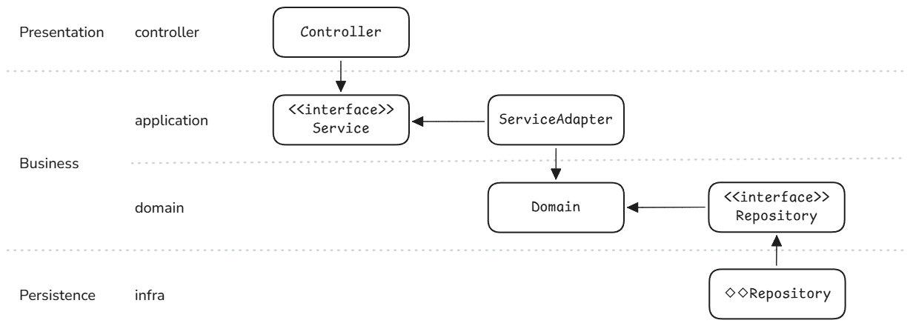

# 이커머스 서버 구현
본 프로젝트는 TDD, 동시성 제어, 대용량 트래픽 등의 학습을 목표로 구현된 이커머스 서버입니다.
이커머스 핵심 기능 주문, 선착순 쿠폰 발급, 잔액 충전 등을 정의하고, **레이어드 아키텍처 기반으로 설계**하여 구현했습니다.
선착순 쿠폰 발급 기능은 **대용량 트래픽**에 대응하기 위해 **카프카**를 활용했습니다.
 

## 🛠️기술 스펙
| 항목 | 기술                                               |
|-----|--------------------------------------------------|
|Backend| Java 17, Spring Boot, Spring Data JPA, Hibernate |
|Database| Mysql, Redis                                     |
|Messaging| Kafka                                            |
|Infra| Docker, Docker Compose                           |
|Monitoring| InfluxDB, k6, Grafana                            |
|Testing| JUnit5, Testcontainers                             |

## 🎯기능 요약
이커머스 서버에서 핵심 기능 위주로 개발하였습니다.
1. 잔액 충전 및 조회
2. 상품 조회
3. 주문 및 결제
4. 선착순 쿠폰 발급 및 사용
 

## 📃설계 문서
- [요구사항 명세서](./docs/requirements.md)
- [시퀀스 다이어그램](./docs/sequenceDiagrams.md)
- [ERD 다이어그램](./docs/erdDiagrams.md)
- [API 명세서](./docs/apiSpec.md)
 

## 📐아키텍쳐 개요

본 프로젝트는 **레이어드 아키텍처**를 기반으로 **의존성 역전 원칙**을 적용한 **"Layered with DIP"** 아키텍처를 지향합니다.

| 계층                 | 설명                                      | 책임                                                        |
|--------------------|-----------------------------------------|-----------------------------------------------------------|
| **Controller**     | 클라이언트의 요청을 받아 적절한 Application 계층에 위임하고 응답 반환 | Request/Response 변환, Validation                           
| **Application**    | 유스케이스를 구현                               | 트랜잭션 관리, 도메인 객체 조합 및 조정, 외부 시스템/도메인 서비스/리포지토리 호출 순서 결정    |
| **Domain**         | 비즈니스 핵심 규칙이 위치하는 계층                     | 도메인 서비스 정의, 객체 간 책임과 상태 변경을 모델링 |
| **Infra** | 외부 시스템과 연결(DB, 외부 API 등)                | Domain 계층에서 정의한 Repository 인터페이스 구현, 기술적 구현 상세 분리         |
 

### ❔Layered with DIP 아키텍처 적용 이유
- **Layered with DIP 아키텍처 학습 목적**
- **관심사 분리**  
  각 계층은 하나의 책임만 가지도록 설계되어 유지보수가 쉽습니다.

- **유연한 테스트 및 확장성**  
  Application이나 Domain 계층은 구현이 아닌 인터페이스에만 의존하고, Infra 계층에서 이를 구현하기 때문에 테스트 환경에서는 Mock 구현체를 쉽게 대체할 수 있습니다.

- **의존성 역전 원칙 적용**  
  상위 계층이 하위 구현에 의존하지 않기 때문에 느슨한 결합을 유지할 수 있습니다.
 

### 프로젝트 아키텍처 구조

 

## 성능 개선 보고서
- [DB 성능 최적화 보고서](./docs/report/STEP08/DB_REPORT.md)
- [동시성 제어 보고서](./docs/report/STEP09/Concurrency_Controll_Report.md)
- [Redis 기반 캐싱 전략 보고서](./docs/report/STEP12/Cache_Strategy_Report.md)
- [Redis 기반 전략 설계 보고서](./docs/report/STEP13_14/Redis_Strategy_Report.md)
- [도메인별 분리 환경에서의 분산 트랜잭션 설계](./docs/report/STEP16/Distributed_Transaction_Design.md)
- [카프카 개념 및 실습](./docs/report/STEP17/Kafka.md)
- [선착순 쿠폰 발급 시스템 - Kafka 전환 설계](./docs/report/STEP18/Kafka_Coupon_System.md)
- [부하 테스트](./docs/report/STEP19/Load_Test.md)
- [가상 장애대응 문서](./docs/report/STEP20/Postmortem.md)
 