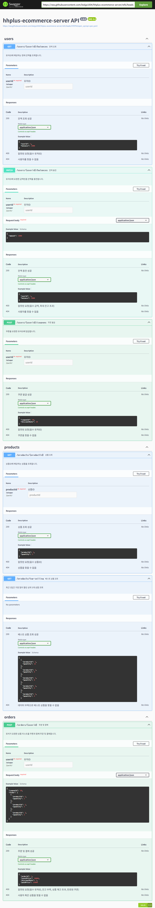

# API 명세서
---
## 작성흐름
- `yaml`파일에 API 명세서를 작성하여 Swagger UI로 확인 가능
- 정의 하지 않은 메소드와 실수로 구현되지 않은 메소드 구분을 위해 정의 하지 않은 메소드도 작성함
- 터미널에 `prism mock ./open_api/api-spec.yaml` 명령어를 입력해 Mock API 서버 실행 ➡️ Postman으로 API 테스트
---
- [API 명세서 Swagger UI로 보기](https://petstore.swagger.io/?url=https://raw.githubusercontent.com/bskjp1004/hhplus-ecommerce-server/refs/heads/STEP04/open_api/api-spec.yaml)

| 메서드     | URL                      | 설명                           | 요청 파라미터 / Body                                                                                            | 응답 예시                                                                          | 응답 코드               |
| ------- | ------------------------ | ---------------------------- | --------------------------------------------------------------------------------------------------------- | ------------------------------------------------------------------------------ | ------------------- |
| `GET`   | `/users/{userId}/balance` | 유저 ID에 해당하는 현재 잔액 조회         | Path: `userId` (integer)                                                                                  | `{ "userId": 1, "balance": 1000 }`                                             | `200`, `400`, `404` |
| `PATCH` | `/users/{userId}/balance` | 유저 ID에 요청한 금액만큼 잔액 충전        | Path: `userId` (integer)   Body: `{ "amount": 1000 }`                                                  | `{ "userId": 1, "balance": 2000 }`                                             | `200`, `400`, `404` |
| `POST`  | `/coupons/{userId}`  | 요청한 유저 ID에 쿠폰 발급             | Path: `userId` (integer)                                                                                  | `{ "couponId": 10, "discountRate": 20 }`                                       | `200`, `400`, `404` |
| `GET`   | `/products/{productId}`  | 상품 ID에 해당하는 상품 조회            | Path: `productId` (integer)                                                                               | `{ "productId": 1, "quantity": 5 }`                                            | `200`, `400`, `404` |
| `GET`   | `/products/top-selling`  | 최근 3일간 가장 많이 팔린 상위 5개 상품 조회  | 없음                                                                                                        | `[{"productId": 1, "quantity": 12}, ...]`                                      | `200`, `404`        |
| `POST`  | `/orders/{userId}`       | 유저가 요청한 상품 리스트와 쿠폰으로 주문 및 결제 | Path: `userId` (integer)   Body: `{ "couponId": 10, "items": [{"productId": 1, "quantity": 2}, ...] }` | `{ "orderId": 2, "totalPrice": 20000, "discountRate": 5, "paidPrice": 19000 }` | `200`, `400`, `404` |

