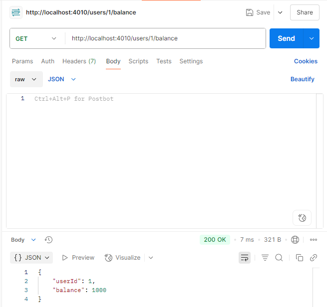
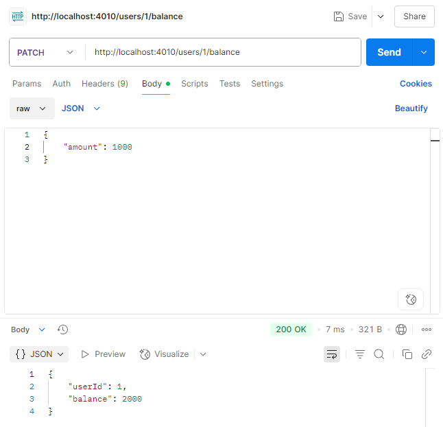
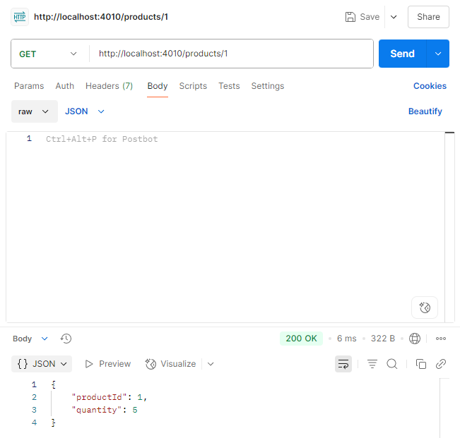
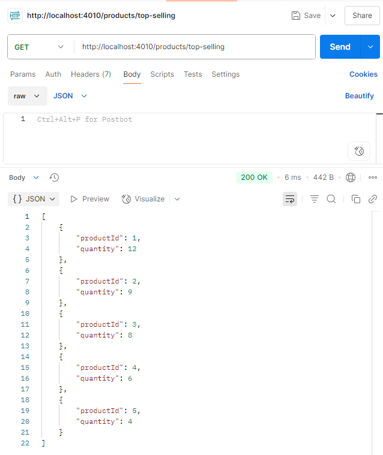
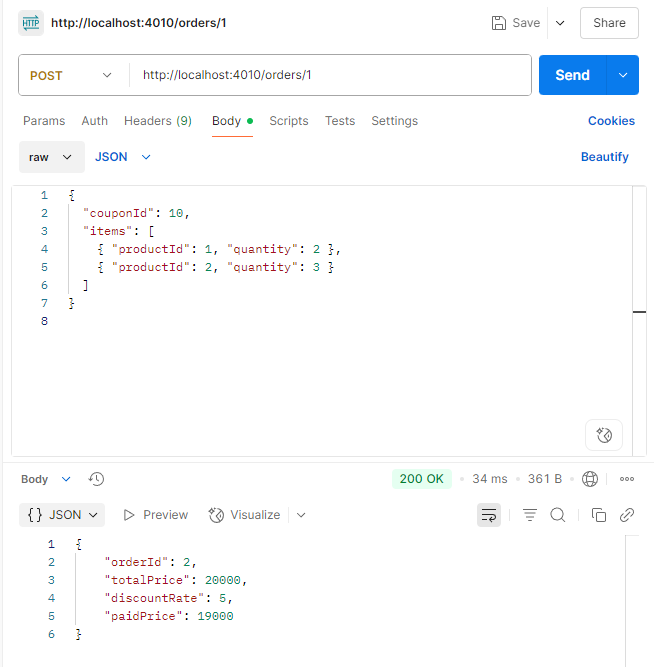
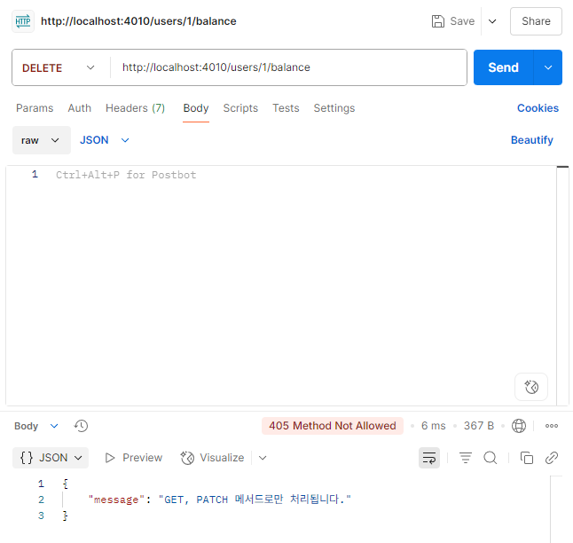

# Mock API 테스트
## Mock API 테스트 성공 결과
- `GET`   | `/users/{userId}/balance`

- `PATCH` | `/users/{userId}/balance`

- `POST`  | `/users/{userId}/coupon`

- `GET`   | `/products/{productId}`

- `GET`   | `/products/top-selling`

- `POST`  | `/orders/{userId}`

---

## Mock API 테스트 정의하지 않은 메서드 결과
