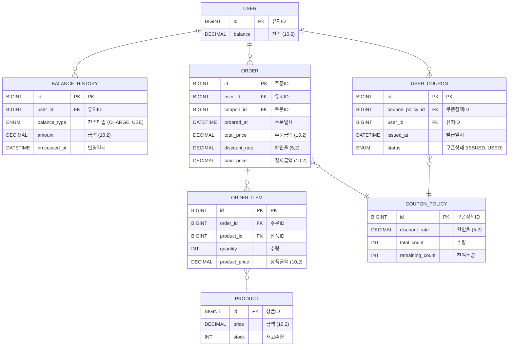

# ERD 다이어그램
## 작성 흐름
- DB 네이밍 규칙은 `소문자`, `스네이크 케이스(snake_case)`
- 참조가 많이 되는 테이블은 ID를 `테이블명_id`로 작명 → 조인이 많이 될 때 가독성 높이기
- JPA 사용을 위해 모든 테이블 `PK` 지정
- `default` 설정: `[유저]` 테이블의 잔액 이외 다른 모든 컬럼은 코드에서 필수로 넣어줘야 하는 것으로 판단
- 실제 DB 설정 
  - `user_id` `FK` 설정 관련 사항
    - `[주문]` 테이블과 같이 유저 삭제되어도 데이터 보존을 위한 테이블은 `FK`미설정
    - `[잔액이력]`은 `[유저]`와 직접 관련 있으니 `FK`설정
  - 클러스터 인덱스 설정 테이블: `[주문]`, `[주문상품]`
  

