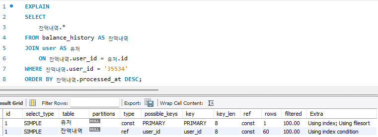

# DB 성능 최적화 보고서


## 조회 성능 저하 기능 식별


1. 최근 3일간 가장 많이 팔린 상위 5개 상품 조회 
2. 특정 유저의 주문 조회 
3. 특정 유저의 잔액 내역 조회

## 쿼리 실행계획 기반 문제 분석


### 1. 최근 3일간 가장 많이 팔린 상위 5개 상품 조회


```sql
// 주문 테이블 인덱스
CREATE INDEX idx_order_ordered_at_desc ON `order` (ordered_at DESC);

// 주문상품 테이블 인덱스
CREATE INDEX idx_order_item_order_id_product_id ON order_item (order_id, product_id);
```

  - `type`이 *ALL*이 아니고, `key`가 *NULL*이 아니지만 `Extra`에서 *Using temporary* 발생

### 2. 특정 유저의 주문 조회

```
// 주문 테이블 인덱스
CREATE INDEX idx_order_ordered_at_desc ON `order` (ordered_at DESC);

// 주문상품 테이블 인덱스
CREATE INDEX idx_order_item_order_id_product_id ON order_item (order_id, product_id);
```
- **주문** 테이블에서 `type`이 *ALL*, `key`가 *NULL* 발생


### 3. 특정 유저의 잔액 내역 조회

```
// 유저 테이블 인덱스
없음

// 잔액이력 테이블 인덱스
없음
```
- `type`이 *ALL*이 아니고, `key`가 *NULL*이 아니지만 `Extra`에서 *Using filesort* 발생

## 인덱스/쿼리 재설계 및 개선안 도출


### 1. 최근 3일간 가장 많이 팔린 상위 5개 상품 조회

- *Using temporary* 개선은 현재 학습용 이커머스 서버에서는 불필요하다고 판단
- 만약 실제 서비스라면, 일별 상품 판매량을 모아두는 테이블을 별도로 운용해 개선하는 방법을 모색함

### 2. 특정 유저의 주문 조회
> **주문** 테이블에서 `type`이 *ALL*, `key`가 *NULL* 발생
- **주문** 테이블에 기존의 단일 인덱스를 `user_id` 컬럼을 인덱스에 추가해 **복합 인덱스**로 개선
```
// ⚠️<개선 전> 주문 테이블 인덱스
CREATE INDEX idx_order_ordered_at_desc ON `order` (ordered_at DESC);

// ✅<개선 후> 주문 테이블 인덱스
CREATE INDEX idx_order_user_id_ordered_at_desc ON `order` (user_id, ordered_at DESC);
```
### 3. 특정 유저의 잔액 내역 조회
> `type`이 *ALL*이 아니고, `key`가 *NULL*이 아니지만 `Extra`에서 *Using filesort* 발생
- **잔액이력** 테이블에 `user_id`, `processed_at` 컬럼을 **복합 인덱스**로 추가
```
// ⚠️<개선 전> 잔액이력 테이블 인덱스
없음

// ✅<개선 후> 잔액이력 테이블 인덱스
CREATE INDEX idx_balance_history_user_id_processed_at_desc ON `balance_history` (user_id, processed_at DESC);
```

