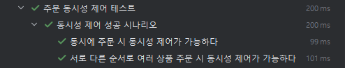

# 동시성 제어 보고서


## ✏️ 배경
DB 자원을 다룰 때 여러 트랜잭션이 동시에 실행될 수 있도록 허용하면서도 데이터의 일관성, 무결성이 유지될 수 있어야 한다.
이에 동시성 문제가 일어날 수 있는 기능을 식별하고, 그에 대한 해결방안을 서술한다.
> 💡동시성 문제: 여러 작업(프로세스, 스레드, 트랜잭션 등) 이 공유 자원에 대해 동시에 접근할 때 발생하는 문제


## ⚠️ 문제
동시성 문제가 일어날 수 있는 기능을 아래와 같이 식별한다.
- 주문 및 결제 기능 
- 잔액 충전 기능 
- 선착순 쿠폰 발급 기능

### 1. <주문 및 결제> 기능 동시성 제어 실패

- 분실 갱신(Lost Update) 가능성
  - `user_coupon` 테이블에서 미사용 상태의 쿠폰 조회로 인한 다른 트랜잭션 작업 결과 분실 가능성 있음
- 동시성 제어 테스트 코드 실행 시 Deadlock(데드락) 발생
  - `user` 테이블 `update`에서 교착 상태 


- 동시성 제어 테스트 코드 실행 시 Deadlock(데드락) 발생
  - `product` 테이블 `update`에서 교착 상태
  - `order_item` 테이블에 상품ID를 정렬하지 않은 채로 `update` 시도 시 데드락 발생


### 2. <잔액 충전> 기능 동시성 제어 실패

- 분실 갱신(Lost Update) 가능성
  - 서로 다른 트랜잭션이 `user` 테이블의 유저 잔액 업데이트 시 다른 트랜잭션의 작업 결과 분실 가능성 있음 
- 동시성 제어 테스트 코드 실행 시 Deadlock(데드락) 발생
  - `user` 테이블 `update`에서 교착 상태


### 3. <선착순 쿠폰 발급> 기능 동시성 제어 실패

- 분실 갱신(Lost Update) 가능성
  - 서로 다른 트랜잭션이 `coupon_policy` 테이블의 남은 쿠폰 수량 업데이트 시 다른 트랜잭션의 작업 결과 분실 가능성 있음
```java
// <테스트 코드>
    // 쿠폰 정책 생성: 쿠폰 재고 50개 
CouponPolicy couponPolicy = couponPolicyRepository.insertOrUpdate(
    CouponPolicy.builder()
        .discountRate(BigDecimal.valueOf(0.1))
        .totalCount(100)
        .remainingCount(50)
        .build()
);

    // 스레드 2개
int threadCount = 2;

// <테스트 코드 결과>
    // ⚠️ 쿠폰 재고 48개 여야 하는데, 실제로는 49개 ➡️ 분실 갱신 발생 
expected: 48
but was: 49
```


## ✅ 해결방법

### 1. <주문 및 결제> 기능 DB Lock 전략

- 쿠폰 사용은 경합이 적고 트랙픽이 많이 발생하지 않으므로 낙관적 락 적용
  - `user_coupon` [유저 쿠폰 소유 및 사용 이력] 테이블 쿠폰 조회 시 낙관적 락 적용
  - 이미 사용된 쿠폰에 대한 재시도는 하지 않음
```java
@Entity
@Table(name = "user_coupon")
public class UserCouponJpaEntity {
    @Id
    @GeneratedValue(strategy = GenerationType.IDENTITY)
    private long id;

    @Column(nullable = false)
    private long couponPolicyId;
    
    // ...

    @Version
    private Long version = 0L; // 낙관적 락 적용 ➡️ version 컬럼 추가
    // ...
}
```
- 상품 재고 차감은 정확성이 중요하므로 비관적 락 적용
  - `product` [상품] 테이블 재고차감 조회 시 비관적 락 적용
```java
    @Lock(LockModeType.PESSIMISTIC_WRITE)
    @Query("select c from ProductJpaEntity c where c.id = :id")
    Optional<ProductJpaEntity> findByIdWithLock(@Param("id") long id);
```


### 2. <잔액 충전> 기능 DB Lock 전략

- 잔액 차감은 정확성이 중요하므로 비관적 락 적용
  - `user` [유저] 테이블 잔액 조회 시 비관적 락 적용
```java
public interface UserJpaRepository extends JpaRepository<UserJpaEntity, Long> {

    @Lock(LockModeType.PESSIMISTIC_WRITE)
    @Query("select u from UserJpaEntity u where u.id = :id")
    Optional<UserJpaEntity> findByIdWithLock(@Param("id") Long id);
}
```


### 3. <선착순 쿠폰 발급> 기능 DB Lock 전략

- 선착순 쿠폰 발급은 경합이 높기 때문에 비관적 락 적용
  - `coupon_policy` [쿠폰 정책] 테이블 발급 할 쿠폰 정책 조회 시 비관적 락 적용
```java
public interface CouponPolicyJpaRepository extends JpaRepository<CouponPolicyJpaEntity, Long> {

    @Lock(LockModeType.PESSIMISTIC_WRITE)
    @Query("select c from CouponPolicyJpaEntity c where c.id = :id")
    Optional<CouponPolicyJpaEntity> findByIdWithLock(@Param("id") Long id);
}
```


## 📑 실험결과

### 1. <주문 및 결제> 기능 테스트 결과

```java
void 서로_다른_순서로_여러_상품_주문_시_동시성_제어가_가능하다() throws InterruptedException {
            // given
            // 1. 사용자 2명 생성 (코드 생략)
  
            // 2. 상품 2개 생성 (코드 생략)
  
            // 3. 주문 요청 생성 - 순서를 반대로
            CreateOrderCommand command1 = new CreateOrderCommand(
                user1.getId(),
                null,
                List.of(
                    new OrderItemCommand(productA.getId(), 1),
                    new OrderItemCommand(productB.getId(), 1)
                )
            );

            CreateOrderCommand command2 = new CreateOrderCommand(
                user2.getId(),
                null,
                List.of(
                    new OrderItemCommand(productB.getId(), 1),
                    new OrderItemCommand(productA.getId(), 1)
                )
            );

            // 4. 스레드 준비 (코드 생략)
  
            // when
            executor.submit(() -> {
                try {
                    startLatch.await();

                    transactionTemplate.execute(status -> {
                       try {
                           orderFacade.placeOrderWithPayment(command1);
                       } catch (Exception e) {
                           status.setRollbackOnly();
                       }
                       return null;
                    });

                } catch (Exception e) {
                    e.printStackTrace();
                } finally {
                    doneLatch.countDown();
                }
            });

            executor.submit(() -> {
                try {
                    startLatch.await();
                    transactionTemplate.execute(status -> {
                        try {
                            orderFacade.placeOrderWithPayment(command2);
                        } catch (Exception e) {
                            status.setRollbackOnly();
                        }
                        return null;
                    });
                } catch (Exception e) {
                    e.printStackTrace();
                } finally {
                    doneLatch.countDown();
                }
            });

            // ...

            // then
            assertAll(
                // 모든 주문 성공
                () -> {
                    transactionTemplate.execute(status -> {
                    List<Order> orders1 = orderRepository.findAllByUserId(user1.getId());
                    assertThat(orders1).hasSize(1);
                        return null;
                    });
                    transactionTemplate.execute(status -> {
                    List<Order> orders2 = orderRepository.findAllByUserId(user2.getId());
                    assertThat(orders2).hasSize(1);
                        return null;
                    });
                },
                // 요청한 상품 재고 차감 성공
                () -> {
                    transactionTemplate.execute(status -> {
                    Product finalProductA = productRepository.findById(productA.getId()).orElseThrow();
                    assertThat(finalProductA.getStock()).isEqualTo(8);
                        return null;
                    });
                    transactionTemplate.execute(status -> {
                    Product finalProductB = productRepository.findById(productB.getId()).orElseThrow();
                    assertThat(finalProductB.getStock()).isEqualTo(8);
                    return null;
                });
                }
            );
        }
```

### 2. <잔액 충전> 기능 테스트 결과

```java
    void 여러_스레드에서_잔액_충전_시_성공한다() throws InterruptedException {
        // given: 유저 생성
        BigDecimal 충전잔액 = BigDecimal.valueOf(10_000L);
        User user = userRepository.insertOrUpdate(User.empty());
        // ...

        // when: 2개의 스레드를 이용해 동시성 재현
        for (int i = 0; i < threadCount; i++) {
            executor.submit(() -> {
                try {
                    startLatch.await();

                    transactionTemplate.execute(status -> {
                        try {
                            userService.chargeBalance(user.getId(), 충전잔액);
                        } catch (Exception e) {
                        }
                        return null;
                    });

                } catch (Exception e){
                } finally {
                    doneLatch.countDown();
                }
            });
        }
        // ...

        // then: 분실갱신 없이 총 20,000원 충전 완료
        assertAll(
            () -> {
                transactionTemplate.execute(status -> {
                    User finalUser = userRepository.findById(user.getId()).orElseThrow();
                    assertThat(finalUser.getBalance()).isEqualByComparingTo((BigDecimal.valueOf(20_000L)));
                    return null;
                });

            }
        );
    }
```

### 3. <선착순 쿠폰 발급> 기능 테스트 결과

```java
void 동시에_선착순_쿠폰_발급_요청_시_동시성_제어가_가능하다() throws InterruptedException {
        // given
        // 1. 쿠폰 정책 생성 (코드 생략)
        // 2. 스레드 준비 (코드 생략)

        // when
        for (int i = 0; i < threadCount; i++) {
            executor.submit(() -> {
                try {
                    startLatch.await();

                    transactionTemplate.execute(status -> {
                        try {
                            User user = userRepository.insertOrUpdate(
                                User.empty()
                            );
                            userIds.add(user.getId());

                            couponService.issueLimitedCoupon(user.getId(), couponPolicy.getId());
                            successCount.incrementAndGet();
                        } catch (Exception e) {
                            failCount.incrementAndGet();
                            status.setRollbackOnly();
                        }
                        return null;
                    });
                } catch (Exception e) {
                    failCount.incrementAndGet();
                } finally {
                    doneLatch.countDown();
                }
            });
        }

        // ...

        // then
        assertAll(
            // 성공 1개, 실패 1개
            () -> {
                assertThat(successCount.get()).isEqualTo(1);
                assertThat(failCount.get()).isEqualTo(1);
            },
            // 발급된 쿠폰은 1개
            () -> {
                List<UserCoupon> updatedUserCoupons = userCouponRepository.findAllByCouponPolicyId(couponPolicy.getId());
                assertThat(updatedUserCoupons.size()).isEqualTo(1);
            },
            // 쿠폰 정책 잔여 수량 0
            () -> {
                transactionTemplate.execute(status -> {
                CouponPolicy finalCouponPolicy = couponPolicyRepository.findById(couponPolicy.getId()).orElseThrow();
                assertThat(finalCouponPolicy.getRemainingCount()).isEqualByComparingTo(0);
                    return null;
                });
            }
        );
    }
```


## ⛔ 한계점

- 비관적 락으로 적용된 아래의 기능은 **트래픽이 증가**함에 따라 **대기 시간이 길어지는 한계**가 있음
  - 주문 및 결제
  - 선착순 쿠폰 발급
- DB Lock 전략만으로는 **선착순 쿠폰 발급** 기능은 구현에 한계가 있음
  - 선착순 쿠폰 발급 기능이 동시성 제어는 해결되었지만, 선착순을 보장하지는 않음
  - 요청 순서대로 처리할 수 있도록 Queue(큐)나 타임스탬프를 이용한 구현이 필요함


## 🗨️ 결론

본 프로젝트에서 3가지 핵심 기능의 동시성 문제를 식별하고, DB Lock 전략을 통해 문제를 해결하였다.

### 주요 성과
- **데이터 무결성 보장**: 분실 갱신과 데드락 문제 해결
- **적절한 Lock 전략**: 기능별 특성에 맞는 낙관적/비관적 락 적용
- **검증 완료**: 모든 동시성 시나리오에 대한 테스트 통과

### 향후 개선 방안
- **성능 최적화**: Redis를 활용한 분산 락 도입 검토
- **모니터링**: Lock 대기 시간 및 처리량 지표 수집
