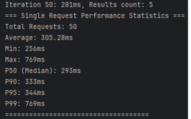
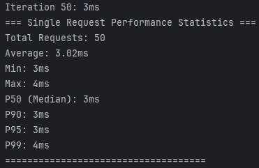
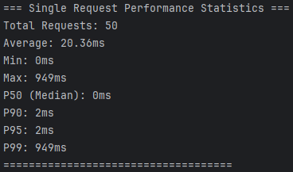
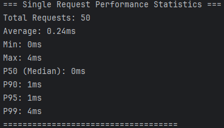

# Redis 기반 캐싱 전략 보고서

## 1. 현황 분석

### 1.1 성능 병목 구간 식별
현재 시스템에서 성능 개선이 필요한 주요 구간:

| 구간 | 현재 소요시간   | 복잡도 | 변경 빈도 | 캐시 필요성 |
|------|-----------|--------|-----------|----|
| 인기 상품 조회 | 256~769ms | 높음 (JOIN, GROUP BY) | 낮음 | 상  |
| 상품 단건 조회 | 3~4ms     | 낮음 | 낮음 | 중  |

- 인기 상품 조회



- 상품 단건 조회



### 1.2 캐시 적용 대상 선정
- **1순위**: 인기 상품(TOP 5) 조회 
- **2순위**: 상품 단건 조회

## 2. 캐싱 전략 설계 및 적용

### 2.1 인기 상품 조회 캐싱

#### 캐시 키 설계
```
Pattern: TOP_SELLING:days:{days}:limit:{limit}
Example: TOP_SELLING:days:3:limit:5
```

#### 캐시 정책
- **TTL**: 3시간
  - 마케팅 및 이벤트로 인한 점심 및 저녁 시간대 특정 상품의 주문이 급등하는 것을 고려해 24시간을 3시간씩 구간을 설정
- **캐시 전략**: Look-Aside
- **갱신 전략**: TTL 만료 시 자동 갱신

#### 구현 예시
```java
@Service
@RequiredArgsConstructor
public class ProductFacade {

  @Cacheable(
          value = "topSellingProducts",
          key = "'days:3:limit:5'",
          unless = "#result.isEmpty()"
  )
  @Transactional(readOnly = true)
  public List<ProductResult> getTopSellingProducts() {
  }
}
```

### 2.2 상품 정보 캐싱
- 재고수량을 제외한 상품 정보 조회 기능에만 캐시 적용
#### 캐시 키 설계
```
Pattern: PRODUCT:{productId}
Example: PRODUCT:2001
```

#### 캐시 정책
- **TTL**: 24시간
- **캐시 전략**: Look-Aside
- **갱신 전략**: TTL 만료 시 자동 갱신
```java
@Service
@RequiredArgsConstructor
public class ProductService {

    private final ProductRepository productRepository;

  // 상품 정보(상품ID, 가격)만 조회
  @Cacheable(
          value = "products",
          key = "#productId",
          unless = "#result == null"
  )
  @Transactional(readOnly = true)
  public ProductInfoResult getProductInfo(long productId) {
    return productRepository.findById(productId)
            .map(ProductInfoResult::from)
            .orElseThrow(() -> new BusinessException(ErrorCode.PRODUCT_NOT_FOUND));
  }    
    
    // 상품 재고수량 까지 포함된 조회
    @Transactional(readOnly = true)
    public ProductResult getProduct(long productId) {
        return productRepository
            .findById(productId)
            .map(ProductResult::from )
            .orElseThrow(() -> new BusinessException(ErrorCode.PRODUCT_NOT_FOUND));
    }
}
```


## 3. 성능 개선

### 3.1 인기 상품 조회
- **개선 전**: 평균 **305.28ms**, p99 769ms
- **개선 후**: 평균 **20.36ms**, p99 949ms
- **개선율(평균)**: 93% 응답시간 감소

| 개선 전                      | 개선 후                      |
|---------------------------|---------------------------|
|  |  |


### 3.2 상품 단건 조회
- **개선 전**: 평균 **3.02ms**, p99 4ms
- **개선 후**: 평균 **0.24ms**, p99 4ms
- **개선율(평균)**: 92% 응답시간 감소


| 개선 전                | 개선 후                      |
|---------------------|---------------------------|
|  |  | 


## 4. 결론

Redis 기반 캐싱 전략 도입으로 아래와 같이 성능이 개선되었다.
- **인기 상품 조회 성능 93% 개선**
- **상품 단건 조회 성능 92% 개선**

특히 인기 상품 조회 기능의 성능 개선이 사용자 경험 향상에 크게 기여할 것으로 예상된다.
