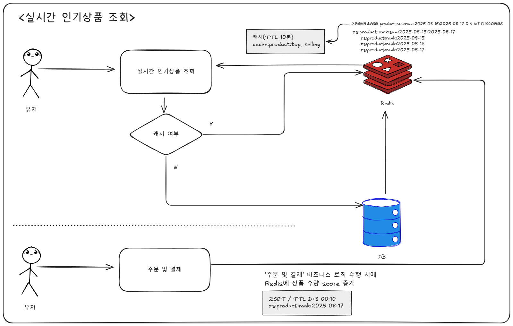
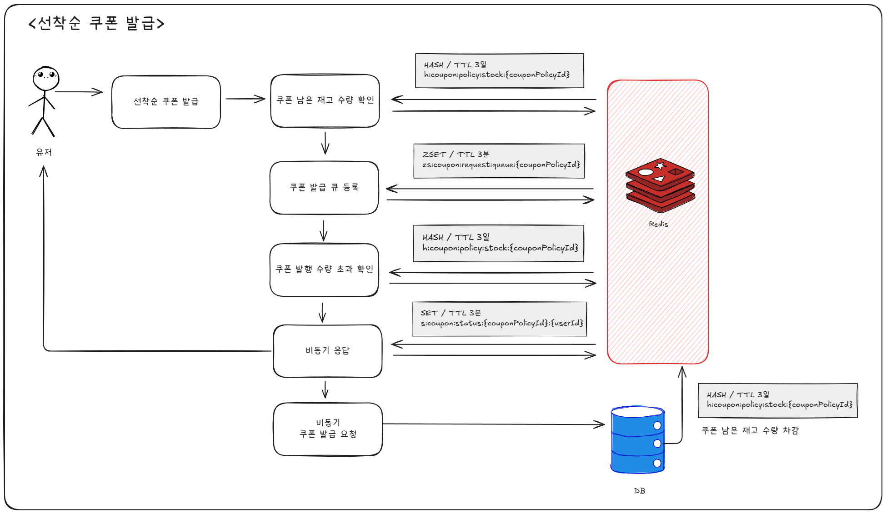
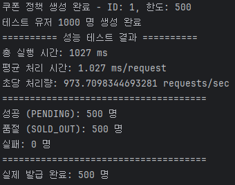

# Redis 기반 전략 설계 보고서

## 실시간 랭킹 시스템 설계
### 문제 인식
- 인기 상품 집계 시 DB 부하(`JOIN, GROUP BY`)를 Redis로 이관

### 요구사항 재정의
#### 기존 설계
- 최근 3일간 잘 팔린 상품 5개 조회('오늘' 데이터는 포함하지 않는 **불변 데이터**)
#### 수정된 설계
- **오늘을 포함**한 최근 3일 잘 팔린 상품 5개 조회(실시간 인기 상품 반영한 **가변 데이터**)
  - 실시간은 **10분**으로 정의

### Redis 기반 설계

- 주문 및 결제 시 Redis에 날짜별로 `상품ID`를 `ZSET`으로 저장해 Score로 순위 매기기
- 날짜별 `ZSET`을 활용해 기준일을 포함한 3일간 합산 `상품ID` 랭킹 `ZSET` 만들기
- Redis에서 3일간 잘 팔린 상품 TOP 5의 `상품ID`를 기반으로 DB에서 상품 조회하기
- 조회한 데이터를 캐시(`cache:product:top_selling`)에 저장하기
- 스케줄러를 활용해 정각 10분마다 **인기 상품 조회** 캐시를 갱신하여 실시간 인기 상품 데이터 반영

```json
// 당일 상품 실시간 랭킹 (ZSET) - TTL: 생성일 기준 D+3 00:10 만료
zs:product:rank:2025-08-18

// 3일간 합산 상품 랭킹 (ZSET) - TTL: 10분
zs:product:rank:sum:2025-08-15_2025-08-18

// 캐시 인기 상품 조회(스케줄러를 활용해 정각 10분 마다 캐시 갱신) - TTL: 10분
cache:product:top_selling
```
### 구현
- `getTopSellingProductsFromRedis()`
  - Redis에 저장된 날짜별 집계 `ZSET`에서 최근 3일간 인기상품 `상품ID`를 5개 조회
  - DB에서 해당하는 상품 정보 조회
  - TOP 5 인기상품 캐시 저장

```java
public class ProductFacade {
    
    private final ProductService productService;
    private final OrderService orderService;
    private final RedisTemplate<String, Object> redisTemplate;
    
    @Cacheable(
        value = "#{T(kr.hhplus.be.server.config.redis.RedisKey).CACHE_PRODUCT_TOP_SELLING_3_DAYS_TOP_5.key()}",
        key = "'days:3:limit:5'",
        unless = "#result.isEmpty()"
    )
    @Transactional(readOnly = true)
    public List<ProductResult> getTopSellingProductsFromRedis() {
        List<Long> topSellingProductIds = getTopProductIdsFromRedis();

        if (topSellingProductIds.isEmpty()) {
            getTopSellingProducts();
        }

        List<Product> products = productService.getProductDomains(topSellingProductIds);

        return topSellingProductIds.stream()
            .map(productId -> products.stream()
                .filter(product -> product.getId() == productId)
                .findFirst()
                .map(ProductResult::from)
                .orElse(null))
            .filter(result -> result != null)
            .toList();
    }

    public List<Long> getTopProductIdsFromRedis() {
        int days = 3;
        int limit = 5;
        LocalDateTime endDate = LocalDateTime.now();
        LocalDate startDate = (endDate.toLocalDate()).minusDays(days - 1);

        String startStr = startDate.format(DateTimeFormatter.ISO_LOCAL_DATE);
        String endStr = endDate.format(DateTimeFormatter.ISO_LOCAL_DATE);

        String sumKey = RedisKey.PRODUCT_RANK_SUM_RANGE.key(startStr, endStr);
        Duration ttl = RedisKey.PRODUCT_RANK_SUM_RANGE.ttlFromNow(endDate);

        if (!redisTemplate.hasKey(sumKey)) {
            // 3일치 일별 데이터 합산
            List<String> dailyKeys = new ArrayList<>();
            for (int i = 0; i < days; i++) {
                LocalDate date = (endDate.toLocalDate()).minusDays(i);
                String dateStr = date.format(DateTimeFormatter.ISO_LOCAL_DATE);
                dailyKeys.add(RedisKey.PRODUCT_RANK_DAILY.key(dateStr));
            }

            // ZUNIONSTORE 실행
            redisTemplate.opsForZSet()
                .unionAndStore(null, dailyKeys, sumKey);

            // 10분 TTL 설정
            redisTemplate.expire(sumKey, ttl);
        }

        // 상위 5개 조회
        Set<TypedTuple<Object>> topProducts =
            redisTemplate.opsForZSet()
                .reverseRangeWithScores(sumKey, 0, limit - 1);

        return RedisZSetUtils.convertToLongList(topProducts);
    }

    @Transactional(readOnly = true)
    public List<ProductResult> getTopSellingProducts() {
      // OrderService를 통해 최근 3일간 가장 많이 팔린 상품ID 5개 조회
      List<Long> topSellingProductIds = orderService.getTopSellingProductIds(3, 5);
    
      if (topSellingProductIds.isEmpty()) {
        throw new BusinessException(ErrorCode.INSUFFICIENT_SALES_DATA);
      }
    
      List<Product> products = productService.getProductDomains(topSellingProductIds);
    
      return topSellingProductIds.stream()
              .map(productId -> products.stream()
                      .filter(product -> product.getId() == productId)
                      .findFirst()
                      .map(ProductResult::from)
                      .orElse(null))
              .filter(result -> result != null)
              .toList();
    }
}
```

- 정각 10분 마다 **인기 상품 조회** 캐시 생성
```java
@Component
@RequiredArgsConstructor
@Slf4j
public class ProductCacheScheduler {

    private final CacheManager cacheManager;
    private final ProductFacade productFacade;

    @Scheduled(cron = "0 */10 * * * *")
    public void refreshTopSellingProducts() {
        try {
            String cacheKey = RedisKey.CACHE_PRODUCT_TOP_SELLING_3_DAYS_TOP_5.key();
            Cache cache = cacheManager.getCache(cacheKey);
            if (cache != null) {
                cache.clear();
            }

            productFacade.getTopSellingProductsFromRedis();
            log.info("인기 상품 캐시 갱신 완료");
        } catch (Exception e) {
            log.error("인기 상품 캐시 갱신 실패", e);
        }
    }
}
```


## 선착순 쿠폰 발급 시스템 설계

### 문제 인식
- 분산 락을 활용해 동시성 제어는 해결했지만, **진정한 의미의 선착순**은 해결하지 못했음
- 선착순 쿠폰 발급 시 대용량 트래픽이 발생한다면, DB에 큰 부하가 발생함

### Redis 기반 설계

- 쿠폰 발행 수량을 Redis `HASH`에서 가져오기
- 쿠폰 발급 요청 큐를 `ZSET`으로 구현해 선착순 보장하기(`NX` 옵셥으로 중복 요청 방지)
  - 단, 서버시간 기준 먼저 도달한 요청을 기준으로 함
- 쿠폰 발행 수량을 초과하는 요청은 쿠폰 발급 실패 처리
- 순위 안의 도달한 요청은 비동기로 DB에 쿠폰 발행 요청
- 사용자는 비동기 응답으로 쿠폰 발행 상태를 확인함

```json
// 쿠폰 발급 큐 (ZSET) - TTL: 3분
zs:coupon:request:queue:{couponPolicyId}

// 쿠폰 발급 상태 비동기 응답 (SET) - TTL: 3분
s:coupon:status:{couponPolicyId}:{userId}

// 쿠폰 정책 재고수량 (Hashes: total_count, remaining_count)
  //TTL: 생성일 기준 D+3 00:10 만료(쿠폰 만료일 기능 추가 시 쿠폰 만료일로 설정)
h:coupon:policy:stock:{couponPolicyId}
```

### 구현
- `issueLimitedCouponFromRedis(long userId, long couponPolicyId)`
  - Redis를 활용한 `쿠폰 발급 큐(ZSET)` 등록, DB에 비동기 쿠폰 발급 요청
- `getCouponStockFromRedis(long couponPolicyId)`
  - Redis에서 `쿠폰 정책 재고수량(HASH)` 가져오기
- `initializeCouponStockInRedis(long couponPolicyId)`
  - Redis에 `쿠폰 정책 재고수량(HASH)` 정보 없으면 DB에서 가져와 Redis에 저장
- `processActualCouponIssuance(Long userId, Long couponPolicyId)`
  - `@Async` 쿠폰 발급 DB에서 비동기 처리
- `updateCouponStatus(CouponQueueResponseDto result)`
  - 비동기 응답 객체(`CouponQueueResponseDto`) 상태 변경

```java
public class CouponService {

    private final CouponPolicyRepository couponPolicyRepository;
    private final UserCouponRepository userCouponRepository;
    private final RedisTemplate<String, Object> redisTemplate;
    private final TaskExecutor asyncExecutor;

    private static final String TOTAL_STOCK_HASH_KEY = "total_count";
    private static final String REMAIN_STOCK_HASH_KEY = "remaining_count";
    
    public CouponQueueResponseDto issueLimitedCouponFromRedis(long userId, long couponPolicyId) {
        String key_requestQueue = RedisKey.COUPON_QUEUE.key(couponPolicyId);
        Duration ttl_requestQueue = RedisKey.COUPON_QUEUE.ttlFromNow();

        // 1. Redis Hash에서 쿠폰 재고 정보 조회
        Map<String, Long> couponStock = getCouponStockFromRedis(couponPolicyId);
        long couponTotalCount = couponStock.get(TOTAL_STOCK_HASH_KEY);
        long couponRemainingCount = couponStock.get(REMAIN_STOCK_HASH_KEY);

        // 2. Redis Hash에서 쿠폰 남은 재고 없으면 반환
        if (couponRemainingCount <= 0){
            return CouponQueueResponseDto.soldOut(userId, couponPolicyId,
                String.valueOf(ErrorCode.COUPON_OUT_OF_STOCK));
        }

        // 3. 쿠폰 발급 큐에 ZADD NX로 추가 (이미 존재하면 추가하지 않음)
        double score = System.nanoTime();
        Boolean added = redisTemplate.opsForZSet().addIfAbsent(key_requestQueue, userId, score);

        if (added == null || !added) {
            return CouponQueueResponseDto.failed(userId, couponPolicyId,
                String.valueOf(ErrorCode.COUPON_ALREADY_REQUEST));
        }

        // 쿠폰 발급 큐 첫 번째 사용자일 경우만 TTL 설정
        Long queueSize = redisTemplate.opsForZSet().size(key_requestQueue);
        if (queueSize != null && queueSize == 1) {
            redisTemplate.expire(key_requestQueue, ttl_requestQueue);
        }

        // 4. 쿠폰 발급 큐에 추가 후 순위 확인
        Long rank = redisTemplate.opsForZSet().rank(key_requestQueue, userId);
        
        if (rank == null) {
            return CouponQueueResponseDto.failed(userId, couponPolicyId,
                String.valueOf(ErrorCode.COUPON_ISSUED_UNKNOWN_ERROR));
        }
        
        // 5. 순위가 쿠폰 발행 수량 초과인지 확인
        if (rank >= couponTotalCount) {
            return CouponQueueResponseDto.soldOut(userId, couponPolicyId,
                String.valueOf(ErrorCode.COUPON_OUT_OF_STOCK));
        }
        
        // 6. 비동기 DB 처리 (한도 내 사용자만)
        asyncExecutor.execute(() -> processActualCouponIssuance(userId, couponPolicyId));
        
        return CouponQueueResponseDto.pending(userId, couponPolicyId, rank + 1);
    }

    private Map<String, Long> getCouponStockFromRedis(long couponPolicyId) {
        String key_couponStock = RedisKey.COUPON_POLICY_STOCK.key(couponPolicyId);

        // Redis Hash에서 totalCount, remainingCount 조회
        Object totalCount = redisTemplate.opsForHash().get(key_couponStock, TOTAL_STOCK_HASH_KEY);
        Object remainingCount = redisTemplate.opsForHash().get(key_couponStock, REMAIN_STOCK_HASH_KEY);

        if (totalCount != null && remainingCount != null) {
            return Map.of(
                TOTAL_STOCK_HASH_KEY, Long.parseLong(totalCount.toString()),
                REMAIN_STOCK_HASH_KEY, Long.parseLong(remainingCount.toString())
            );
        }

        // Redis에 없으면 DB에서 조회 후 Redis에 저장
        return initializeCouponStockInRedis(couponPolicyId);
    }

    private Map<String, Long> initializeCouponStockInRedis(long couponPolicyId) {
        CouponPolicy couponPolicy = getCouponPolicyDomain(couponPolicyId);

        String key_couponStock = RedisKey.COUPON_POLICY_STOCK.key(couponPolicyId);
        Duration ttl_couponStock = RedisKey.COUPON_POLICY_STOCK.ttlFromNow();

        // 키가 존재하지 않을 때만 초기화 및 TTL 설정
        if (!redisTemplate.hasKey(key_couponStock)) {
            // Hash에 totalCount, remainingCount 저장
            redisTemplate.opsForHash().put(key_couponStock, TOTAL_STOCK_HASH_KEY, String.valueOf(couponPolicy.getTotalCount()));
            redisTemplate.opsForHash().put(key_couponStock, REMAIN_STOCK_HASH_KEY, String.valueOf(couponPolicy.getRemainingCount()));
            redisTemplate.expire(key_couponStock, ttl_couponStock);
        }

        return Map.of(
            TOTAL_STOCK_HASH_KEY, (long) couponPolicy.getTotalCount(),
            REMAIN_STOCK_HASH_KEY, (long) couponPolicy.getRemainingCount()
        );
    }

    @Async
    @Transactional
    public void processActualCouponIssuance(Long userId, Long couponPolicyId) {
        try {
            // DB에서 쿠폰 정책 조회
            CouponPolicy couponPolicy = couponPolicyRepository.findById(couponPolicyId)
                .orElseThrow(() -> new BusinessException(ErrorCode.COUPON_POLICY_NOT_FOUND));

            // 쿠폰 재고 확인
            if (!couponPolicy.canIssue()) {
                updateCouponStatus(CouponQueueResponseDto.soldOut(userId, couponPolicyId,
                    String.valueOf(ErrorCode.COUPON_OUT_OF_STOCK))
                );
                return;
            }

            // 쿠폰 발급 처리
            CouponPolicy updatedCouponPolicy = couponPolicyRepository.insertOrUpdate(couponPolicy.issue());
            UserCoupon userCoupon = UserCoupon.create(couponPolicy.getId(), userId);
            UserCoupon persistedUserCoupon = userCouponRepository.insertOrUpdate(userCoupon);

            // Redis 쿠폰 정책 남은 재고수량 업데이트
            String key_couponStock = RedisKey.COUPON_POLICY_STOCK.key(couponPolicyId);
            redisTemplate.opsForHash().put(key_couponStock, REMAIN_STOCK_HASH_KEY, String.valueOf(updatedCouponPolicy.getRemainingCount()));

            // 발급 완료 상태로 업데이트
            updateCouponStatus(
                CouponQueueResponseDto.issued(persistedUserCoupon.getUserId(), persistedUserCoupon.getCouponPolicyId())
            );

        } catch (Exception e) {
            // 실패 상태로 업데이트
            updateCouponStatus(CouponQueueResponseDto.failed(userId, couponPolicyId,
                String.valueOf(ErrorCode.COUPON_ISSUED_UNKNOWN_ERROR))
            );
            log.error("쿠폰 발급 실패: userId={}, couponPolicyId={}", userId, couponPolicyId, e);
        }
    }

    private void updateCouponStatus(CouponQueueResponseDto result) {
        try {
            String statusKey = RedisKey.COUPON_STATUS.key(result.getCouponPolicyId(), result.getUserId());
            Duration ttl = RedisKey.COUPON_STATUS.ttlFromNow(LocalDateTime.now());

            redisTemplate.opsForValue().set(statusKey, result, ttl);
        } catch (Exception e) {
            log.error("쿠폰 상태 업데이트 실패: userId={}, couponPolicyId={}", result.getUserId(), result.getCouponPolicyId(), e);
        }
    }
}
```

### 테스트 결과
- 쿠폰 총 수량 500개, 유저 1000명 생성 ➡️ 선착순 쿠폰 동시성 테스트
- 성공 500명, 쿠폰 품절 500명



### 추가 고려사항
- 쿠폰 발행 수량을 Redis `HASH`에서 가져오기
  - 현재는 임의로 TTL을 `D+3 00:10`에 만료되도록 했음
  - <쿠폰 정책 생성> 기능이 생긴다면 해당 로직에서 쿠폰 정책 재고수량을 Redis에 추가하도록 해야함
  - 추가로 `쿠폰 만료일` 컬럼을 쿠폰 정책 테이블에 추가해야함