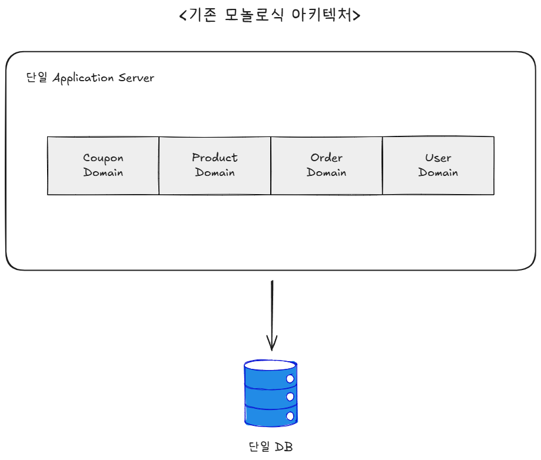
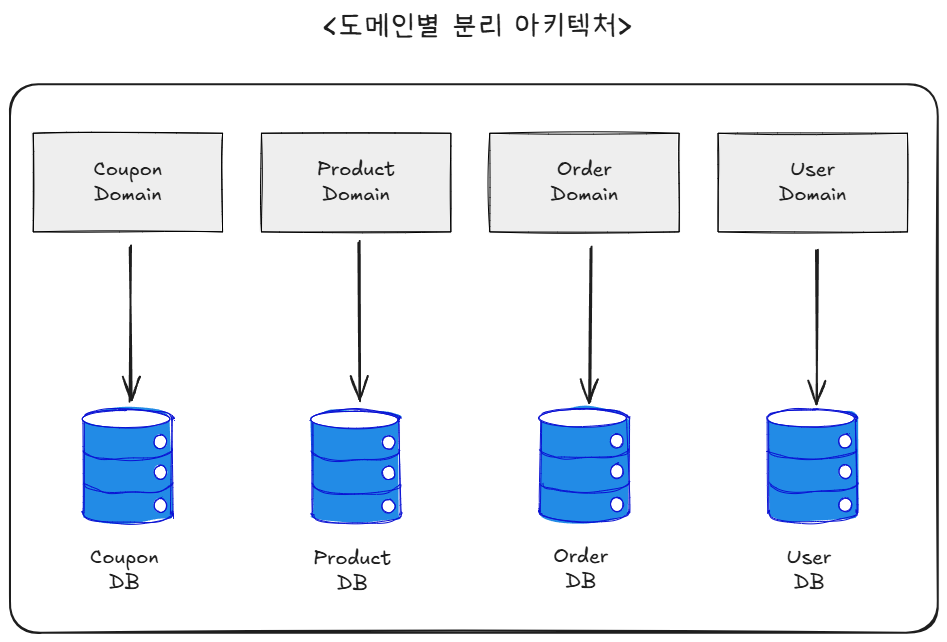
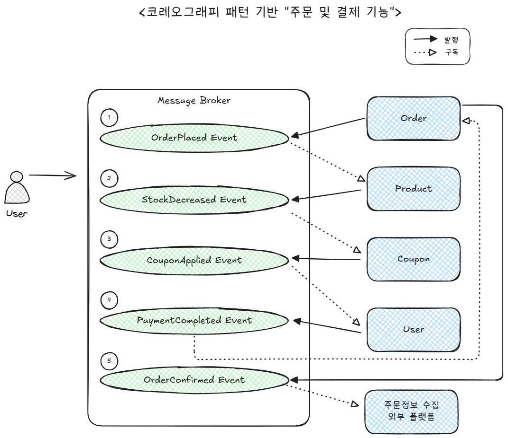
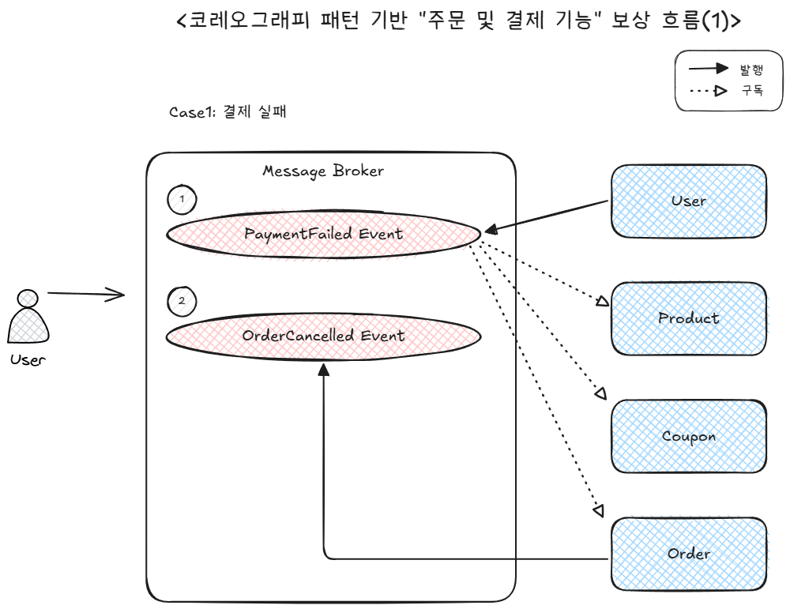
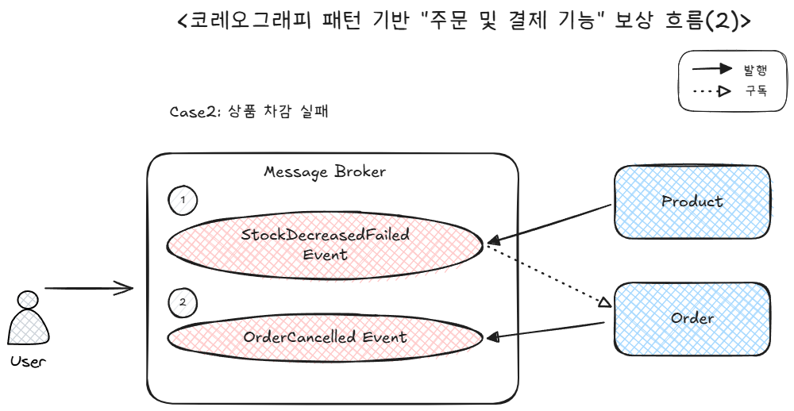
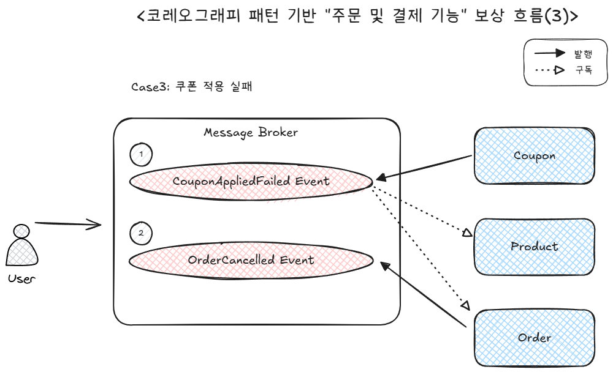

# 도메인별 분리 환경에서의 분산 트랜잭션 설계

## 목차
1. [개요](#1-개요)
2. [현재 시스템 분석](#2-현재-시스템-분석)
3. [도메인 분리 시 발생 가능한 문제점](#3-도메인-분리-시-발생-가능한-문제점)
4. [분산 트랜잭션 해결 패턴](#4-분산-트랜잭션-해결-패턴)
5. [권장 설계 방안](#5-권장-설계-방안)
6. [결론](#6-결론)
7. [고려사항](#7-향후-고려사항)

<br/>

## 1. 개요

### 1.1 배경
현재 이커머스 시스템은 단일 데이터베이스와 단일 어플리케이션 서버로 구성되어 있으며, 모든 도메인이 하나의 트랜잭션 경계 내에서 처리되고 있다. 하지만 서비스 확장에 따라 도메인별로 서버와 데이터베이스를 분리해야 하는 상황이 발생할 수 있다.

### 1.2 목적
- 도메인별 분리 시 발생하는 트랜잭션 문제점 파악
- 데이터 일관성을 보장하는 분산 트랜잭션 설계 방안 제시

<br/>

## 2. 현재 시스템 분석

### 2.1 현재 아키텍처(모놀리식)


### 2.2 주요 트랜잭션 시나리오
현재 `OrderFacade.placeOrderWithPayment()` 메소드에서 처리되는 주문 프로세스는 아래와 같다.

1. **쿠폰 적용** (Coupon Domain)
2. **재고 차감** (Product Domain)  
3. **주문 생성** (Order Domain)
4. **잔액 차감** (User Domain)
5. **Redis 업데이트** (Cache)
6. **이벤트 발행** (Event)

모든 작업이 `@Transactional` 어노테이션으로 하나의 트랜잭션으로 묶여있어, 실패 시 전체 롤백이 보장된다.

---

## 3. 도메인 분리 시 발생 가능한 문제점

### 3.1 분리 후 아키텍처


### 3.2 주요 문제점

#### 3.2.1 원자성(Atomicity) 보장 불가
- **문제**: 여러 서비스에 걸친 작업이 부분적으로만 성공할 수 있음
- **예시**: 재고는 차감되었지만 결제 실패 시 재고가 복구되지 않음
```java
// 분리된 서비스 간 호출 시 트랜잭션 경계가 분리됨
productService.decreaseStock();  // Product DB 커밋
userService.useBalance();        // User DB 실패 → Product DB는 이미 커밋됨
```

#### 3.2.2 격리성(Isolation) 문제
- **문제**: 서비스 간 동시성 제어가 어려워짐
- **예시**: 동일 상품을 여러 사용자가 동시 주문 시 재고 일관성 깨짐

#### 3.2.3 네트워크 분할(Network Partition)
- **문제**: 서비스 간 통신 실패로 인한 데이터 불일치
- **예시**: 주문 서비스와 상품 서비스 간 네트워크 단절

#### 3.2.4 부분 실패(Partial Failure) 처리
- **문제**: 일부 서비스만 성공한 경우 복구 전략 필요
- **예시**: 5개 서비스 중 3개만 성공한 경우의 처리

<br/>

## 4. 분산 트랜잭션 해결 패턴

### 4.1 분산 트랜잭션 관리 패턴 비교

| 패턴 구분 | 장점                        | 단점                                                                |
|-------|---------------------------|-------------------------------------------------------------------|
| 2PC (Two-Phase Commit)  | 강한 일관성 보장<br/> ACID 속성 유지 | 성능 저하<br/> 서비스 간 강결합<br/> NoSQL은 분산 트랜잭션 지원안함<br/> 실무에서 잘 사용되지 않음 | 
| Saga Pattern  | 각 서비스의 로컬 트랜잭션을 순차적으로 실행<br/> 실패 시 보상 트랜잭션(Compensating Transaction)으로 롤백 | 구현 난이도 높음<br/> 중간 상태 노출 가능성<br/> 가시성/디버깅 어려움 | 

- 도메인별 DB 분리를 위해서는 서비스 간 강결합을 만드는 2PC보다 **Saga Pattern**이 더 적절하다.

### 4.2 Saga Pattern 채택

#### Saga Pattern 종류
- **Orchestration Saga**: 중앙 조정자가 전체 플로우 관리
- **Choreography Saga**: 이벤트 기반으로 각 서비스가 자율적으로 동작

| 구분         | Orchestration Saga                                                                                 | Choreography Saga                                                                                 |
| ---------- | -------------------------------------------------------------------------------------------------- | ------------------------------------------------------------------------------------------------- |
| **장점**     | 흐름이 한곳에 모여 **가시성↑**, 디버깅·운영 용이<br>업무 시퀀스 변경 시 **한 군데 수정**으로 대응<br>복잡한 분기/타임아웃/보상 로직을 **명시적으로 모델링** | 서비스 간 **결합도 낮음**, 중앙 장애점 없음<br>구성요소가 느슨해 **확장성·탄력성** 좋음<br>단순한 플로우는 **구현이 간결**                    |
| **단점**     | 오케스트레이터가 **병목/단일 장애점**이 될 수 있음<br>조정자 서비스의 **복잡도·책임 과다**<br>고가용성·스케일 계획이 필수            | 이벤트가 늘며 **흐름 가시성↓**, 디버깅 난이도↑<br>업무 시퀀스 변경 시 **여러 서비스 수정 필요**<br>메시지 순서/중복·재시도 처리 등 **운영 복잡성** 증가 |


<br/>

## 5. 권장 설계 방안
- Orchestration Saga 패턴도 기존의 모놀로식 아키텍처 밋 파사드 패턴과 유사한 중앙 집중식 패턴이므로, 서비스 확장에 따라 도메인별로 서버와 DB가 분리된다면, **Choreography Saga** 패턴으로의 전환이 적절해보인다.

### 5.1 Choreography Saga Pattern 기반 설계
- 주문 및 결제 기능에 대한 Choreography Saga Pattern 기반 설계


#### <정상 흐름> 주문 및 결제 기능


<br/>

#### <보상 흐름 - 결제 실패> 주문 및 결제 기능


<br/>

#### <보상 흐름 - 상품 차감 실패> 주문 및 결제 기능


<br/>

#### <보상 흐름 - 쿠폰 적용 실패> 주문 및 결제 기능


<br/>

## 6. 결론

1. **Saga Pattern 채택**
   - 복잡한 분산 트랜잭션을 관리 가능한 단위로 분할
   - 각 서비스의 자율성 보장

2. **Outbox Pattern 활용**
   - 로컬 트랜잭션과 이벤트 발행의 원자성 보장
   - At-least-once 전달 보장

3. **보상 트랜잭션 설계**
   - 모든 작업에 대한 취소/복구 로직 구현
   - 멱등성(Idempotency) 보장


<br/>

## 7. 향후 고려사항
- InBox/OutBox 패턴 활용
  - 로컬 트랜잭션과 이벤트 발행의 원자성 보장
  - `At-least-once` 전달 보장
- 사용자 요청 시 프론트 엔드에서 상품 금액이 계산된 데이터를 전송 → `ProductService`에서 상품 계산 기능 제외


<br/>

## 참고 자료
- [[MSA] 개인 프로젝트 Monolithic to MSA 전환기 - (8) 분산 트랜잭션 환경에서 트랜잭션 처리하기(feat. 2PC, Saga 패턴, Choreographed Saga)](https://ksh-coding.tistory.com/143)
- [Microservices.io - Saga Pattern](https://microservices.io/patterns/data/saga.html)
- [Microsoft - Saga 분산 트랜잭션 패턴](https://learn.microsoft.com/ko-kr/azure/architecture/patterns/saga)
