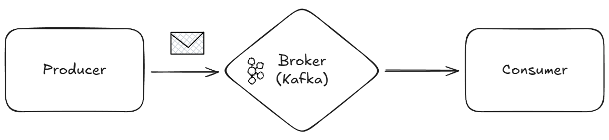

# 카프카 개념 및 실습

## 목차
1. [카프카란?](#1-카프카란)
2. [카프카 작동 방식](#2-카프카-작동-방식)
3. [카프카 간단 구현](#3-카프카-간단-구현)
4. [카프카 관련 디펜던시 추가](#4-카프카-관련-디펜던시-추가)


## 1. 카프카란?
실시간 데이터 파이프라인과 스트리밍 애플리케이션을 구축하기 위해 설계된 오픈 소스 플랫폼이다.



- Producer(프로듀서): 메시지를 발행해 카프카에 적재하는 서비스
- Broker(브로커): 카프카 서버
- Consumer(컨슈머): 카프카에 적재된 메시지를 소비하는 서비스

## 2. 카프카 작동 방식
- `Producer`가 특정 토픽에 메시지 전송 ➡️ `Kafka 클러스터`가 메시지 저장 ➡️ `Consumer`가 토픽에서 메시지 읽음


- **Topic(토픽)**: 카프카에서 메시지를 저장하고 전달하는 논리적인 채널, N개의 파티션으로 구성됨
- **Partition(파티션)**: 토픽을 실제로 물리적으로 저장하는 단위, 메시지는 순서와 오프셋(offset)을 가짐
- **Offset(오프셋)**: 파티션 내 각 메시지의 고유 식별자(순차적 번호), Consumer는 처리한 메시지의 offset을 커밋하여 진행 상황을 추적
- **Consumer Group(컨슈머 그룹)**: 동일한 토픽을 구독하는 Consumer들의 그룹, 각 파티션은 그룹 내 하나의 Consumer에게만 할당되어 병렬 처리 가능
- **Replication(레플리케이션)**: 데이터 손실 방지를 위해 각 파티션을 여러 브로커에 복제하여 저장
- **Leader/Follower(리더/팔로워)**: 각 파티션마다 하나의 Leader 브로커가 읽기/쓰기 처리, 나머지는 Follower로서 복제본 유지

<br/>

## 3. 카프카 간단 구현
- 주문 정보 외부플랫폼 전송을 카프카로 변경
```java
@Slf4j
@Component
@RequiredArgsConstructor
public class OrderEventProducer {

    private final KafkaTemplate<String, OrderPlacedEvent> kafkaTemplate;

    @Value("${spring.kafka.topics.order-placed}")
    private String orderPlacedTopic;

    public void sendOrderPlacedEvent(OrderPlacedEvent event) {
        CompletableFuture<SendResult<String, OrderPlacedEvent>> future = 
                kafkaTemplate.send(orderPlacedTopic, event.eventId(), event);
        
        future.whenComplete((result, throwable) -> {
            if (throwable != null) {
                log.error("주문 정보 이벤트 전송 실패: orderId={}", event.orderId(), throwable);
            } else {
                log.info("주문 정보 이벤트 전송 성공: orderId={}, offset={}",
                        event.orderId(), result.getRecordMetadata().offset());
            }
        });
    }
}
```

<br/>

## 4. 카프카 관련 디펜던시 추가
### 어플리케이션 설정에 카프카 추가(`application.yaml`)
```yaml
  kafka:
    bootstrap-servers: localhost:9092
    producer:
      key-serializer: org.apache.kafka.common.serialization.StringSerializer
      value-serializer: org.springframework.kafka.support.serializer.JsonSerializer
      acks: all
      retries: 3
      enable-idempotence: true
      batch-size: 16384
      linger-ms: 10
      buffer-memory: 33554432
      compression-type: snappy
      properties:
        spring.json.add.type.headers: true
        max.in.flight.requests.per.connection: 5
        request.timeout.ms: 30000
        delivery.timeout.ms: 120000
    consumer:
      group-id: hhplus-order-service
      key-deserializer: org.apache.kafka.common.serialization.StringDeserializer
      value-deserializer: org.springframework.kafka.support.serializer.JsonDeserializer
      auto-offset-reset: earliest
      enable-auto-commit: false
      max-poll-records: 10
      max-poll-interval-ms: 300000
      session-timeout-ms: 30000
      properties:
        spring.json.trusted.packages: "*"
        spring.json.use.type.headers: true
        spring.json.type.mapping: "orderPlacedEvent:kr.hhplus.be.server.order.domain.event.OrderPlacedEvent"
        isolation.level: read_committed
    listener:
      concurrency: 3
      ack-mode: manual
      poll-timeout: 3000
    topics:
      order-placed: order-placed-events
```

### 디펜던시 추가(`build.gradle.kts`)
```kotlin
// Kafka
implementation("org.springframework.kafka:spring-kafka")

// Test
testImplementation("org.testcontainers:kafka")
testImplementation("org.springframework.kafka:spring-kafka-test")
```

### 도커 컴포즈 설정 추가(`docker-compose.yml`)
```yaml
  zookeeper:
    image: confluentinc/cp-zookeeper:7.5.0
    ports:
      - "2181:2181"
    environment:
      ZOOKEEPER_CLIENT_PORT: 2181
      ZOOKEEPER_TICK_TIME: 2000
      ZOOKEEPER_LOG4J_ROOT_LOGLEVEL: ERROR
      ZOOKEEPER_TOOLS_LOG4J_LOGLEVEL: ERROR
    volumes:
      - ./data/zookeeper/:/var/lib/zookeeper/data

  kafka:
    image: confluentinc/cp-kafka:7.5.0
    depends_on:
      - zookeeper
    ports:
      - "9092:9092"
    environment:
      KAFKA_BROKER_ID: 1
      KAFKA_ZOOKEEPER_CONNECT: zookeeper:2181
      KAFKA_LISTENER_SECURITY_PROTOCOL_MAP: PLAINTEXT:PLAINTEXT,PLAINTEXT_HOST:PLAINTEXT
      KAFKA_ADVERTISED_LISTENERS: PLAINTEXT://kafka:29092,PLAINTEXT_HOST://localhost:9092
      KAFKA_INTER_BROKER_LISTENER_NAME: PLAINTEXT
      KAFKA_OFFSETS_TOPIC_REPLICATION_FACTOR: 1
      KAFKA_TRANSACTION_STATE_LOG_MIN_ISR: 1
      KAFKA_TRANSACTION_STATE_LOG_REPLICATION_FACTOR: 1
      KAFKA_AUTO_CREATE_TOPICS_ENABLE: "true"
      KAFKA_LOG4J_ROOT_LOGLEVEL: ERROR
      KAFKA_TOOLS_LOG4J_LOGLEVEL: ERROR
    volumes:
      - ./data/kafka/:/var/lib/kafka/data
```