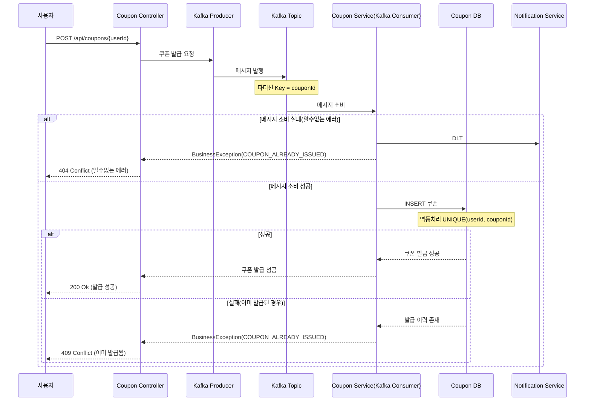

# 선착순 쿠폰 발급 시스템 - Kafka 전환 설계

## 1. 개요

기존의 Redis로 구현된 선착순 쿠폰 발급 기능을 Kafka 기반 비동기 시스템으로 전환하여 대용량 트래픽 처리 성능을 향상시킨다.
- Kafka의 파티션 메시지 큐 방식으로 선착순 보장
- 장애대응: 알 수없는 장애로 처리되지 못한 메시지는 DLT에 적재 

<br/>

## 2. 비즈니스 시퀀스 다이어그램

### 2.1 쿠폰 발급 요청 처리 플로우



<br/>

## 3. Kafka 아키텍처 구성

### 3.1 Topic 구조

#### 선착순 쿠폰 Topic: coupon-issue-topic

| 설정 항목 | 값 | 설명 |
|---------|-----|------|
| Partitions | 10 | 병렬 처리를 위한 파티션 수 |
| Replication Factor | 3 | 데이터 안정성을 위한 복제 수 |
| Retention Period | 7 days | 메시지 보관 기간 |
| Cleanup Policy | delete | 정리 정책 |


### 3.2 Producer 설정

```yaml
kafka:
  producer:
    key-serializer: org.apache.kafka.common.serialization.StringSerializer
    value-serializer: org.springframework.kafka.support.serializer.JsonSerializer
    acks: all
    retries: 3
    enable-idempotence: true
    batch-size: 16384
    linger-ms: 10
    buffer-memory: 33554432
    compression-type: snappy
    properties:
      spring.json.add.type.headers: true
      max.in.flight.requests.per.connection: 5
      request.timeout.ms: 30000
      delivery.timeout.ms: 120000
```

### 3.3 Consumer 설정

```yaml
kafka:
  consumer:
    group-id: hhplus-order-service
    key-deserializer: org.apache.kafka.common.serialization.StringDeserializer
    value-deserializer: org.springframework.kafka.support.serializer.JsonDeserializer
    auto-offset-reset: earliest
    enable-auto-commit: false
    max-poll-records: 10
    max-poll-interval-ms: 300000
    session-timeout-ms: 30000
    properties:
      spring.json.trusted.packages: "*"
      spring.json.use.type.headers: true
      spring.json.type.mapping: "couponIssueRequest:kr.hhplus.be.server.coupon.domain.event.CouponIssueRequest"
      isolation.level: read_committed
```

<br/>

## 4. 결론

Kafka 기반 선착순 쿠폰 발급 시스템으로의 전환을 통해 대규모 프로모션 이벤트 시에도 안정적인 쿠폰 발급 서비스를 제공할 수 있다.