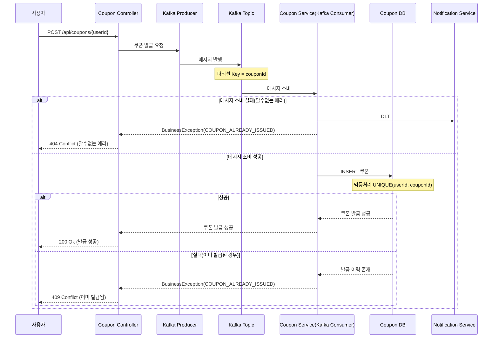
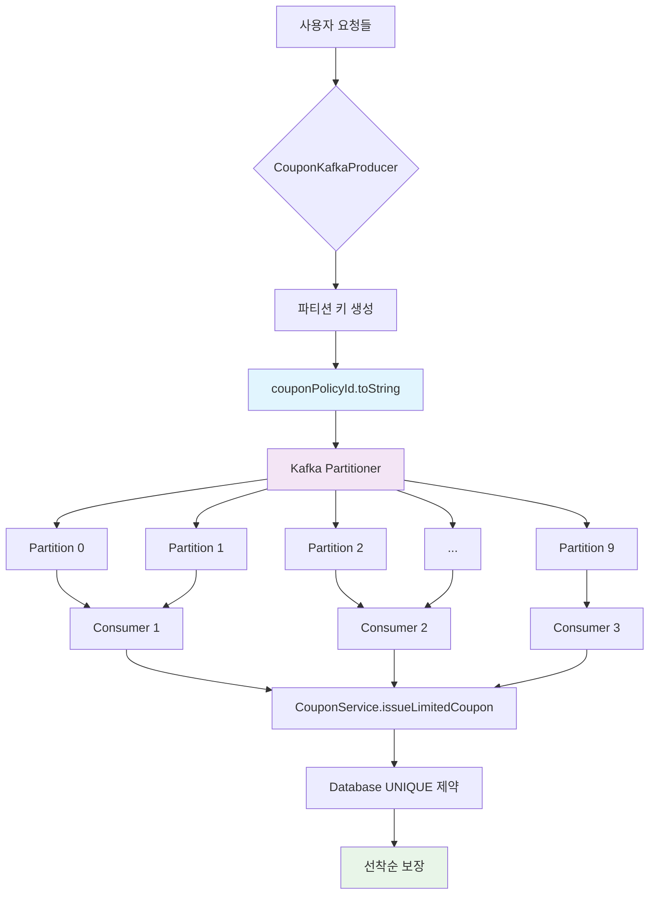

# 선착순 쿠폰 발급 시스템 - Kafka 전환 설계

## 목차
1. [개요](#1-개요)
2. [비즈니스 시퀀스 다이어그램](#2-비즈니스-시퀀스-다이어그램)
3. [Kafka 아키텍처 구성](#3-Kafka-아키텍처-구성)
4. [결론](#4-결론)


## 1. 개요

기존의 Redis로 구현된 선착순 쿠폰 발급 기능을 Kafka 기반 비동기 시스템으로 전환하여 대용량 트래픽 처리 성능을 향상시킨다.
- Kafka의 파티션 메시지 큐 방식으로 선착순 보장
- 장애대응: 알 수없는 장애로 처리되지 못한 메시지는 DLT에 적재 

<br/>

## 2. 비즈니스 시퀀스 다이어그램

### 2.1 쿠폰 발급 시퀀스 다이어그램



### 2.2 쿠폰 발급 플로우


<br/>

## 3. Kafka 아키텍처 구성

### 3.1 Topic 구조

#### 선착순 쿠폰 Topic: coupon-issue-topic

| 설정 항목 | 값 | 설명 |
|---------|-----|------|
| Partitions | 10 | 병렬 처리를 위한 파티션 수 |
| Replication Factor | 3 | 데이터 안정성을 위한 복제 수 |
| Retention Period | 7 days | 메시지 보관 기간 |
| Cleanup Policy | delete | 정리 정책 |


### 3.2 Producer 설정

```yaml
kafka:
  producer:
    key-serializer: org.apache.kafka.common.serialization.StringSerializer
    value-serializer: org.springframework.kafka.support.serializer.JsonSerializer
    acks: all
    retries: 3
    enable-idempotence: true
    batch-size: 16384
    linger-ms: 10
    buffer-memory: 33554432
    compression-type: snappy
    properties:
      spring.json.add.type.headers: true
      max.in.flight.requests.per.connection: 5
      request.timeout.ms: 30000
      delivery.timeout.ms: 120000
```

### 3.3 Consumer 설정

```yaml
kafka:
  consumer:
    group-id: hhplus-order-service
    key-deserializer: org.apache.kafka.common.serialization.StringDeserializer
    value-deserializer: org.springframework.kafka.support.serializer.JsonDeserializer
    auto-offset-reset: earliest
    enable-auto-commit: false
    max-poll-records: 10
    max-poll-interval-ms: 300000
    session-timeout-ms: 30000
    properties:
      spring.json.trusted.packages: "*"
      spring.json.use.type.headers: true
      spring.json.type.mapping: "couponIssueRequest:kr.hhplus.be.server.coupon.domain.event.CouponIssueRequest"
      isolation.level: read_committed
```

### 3.4 CouponIssueEventListener
```java
@Slf4j
@Component
@RequiredArgsConstructor
public class CouponIssueEventListener {

    private final CouponService couponService;
    
    @RetryableTopic(
        attempts = "3",
        backoff = @Backoff(delay = 1000, multiplier = 2.0),
        exclude = {BusinessException.class}
    )
    @KafkaListener(
        topics = "${spring.kafka.topics.coupon-issue}",
        groupId = "coupon-issue-consumer-group",
        containerFactory = "kafkaListenerContainerFactory"
    )
    public void handleCouponIssueRequest(
            @Payload CouponIssueRequest request,
            @Header(KafkaHeaders.RECEIVED_PARTITION) int partition,
            @Header(KafkaHeaders.OFFSET) long offset,
            Acknowledgment ack) {

        try {
            couponService.issueLimitedCoupon(request.getUserId(), request.getCouponPolicyId());

            ack.acknowledge();
            
        } catch (BusinessException e) {
            // 비즈니스 예외는 재시도하지 않고 정상 완료 처리
            ack.acknowledge();
            
        } catch (Exception e) {
            log.error("쿠폰 발급 처리 중 시스템 오류: userId={}, couponPolicyId={}", 
                request.getUserId(), request.getCouponPolicyId(), e);
            throw e;
        }
    }
    
    @KafkaListener(
        topics = "${spring.kafka.topics.coupon-issue}.DLT",
        groupId = "coupon-issue-dlt-consumer-group",
        containerFactory = "dltListenerContainerFactory"
    )
    public void handleDLTMessage(
            @Payload CouponIssueRequest request,
            @Header(KafkaHeaders.RECEIVED_PARTITION) int partition,
            @Header(KafkaHeaders.OFFSET) long offset,
            Acknowledgment ack) {

        // DLT 메시지에 대한 추가 처리
        log.error("DLT 메시지 처리 - 최종 실패: userId={}, couponPolicyId={}, partition={}, offset={}", 
            request.getUserId(), request.getCouponPolicyId(), partition, offset);

        ack.acknowledge();
    }
}
```
### 3.5 CouponKafkaProducer
```java
@Slf4j
@Component
@RequiredArgsConstructor
public class CouponKafkaProducer {
    
    private final KafkaTemplate<String, Object> kafkaTemplate;
    
    @Value("${spring.kafka.topics.coupon-issue}")
    private String couponIssueTopic;
    
    public CouponQueueResponseDto publishCouponIssueRequest(Long userId, Long couponPolicyId) {
        try {
            CouponIssueRequest request = CouponIssueRequest.create(userId, couponPolicyId);
            
            // couponPolicyId를 파티션 키로 사용하여 선착순 보장
            String partitionKey = String.valueOf(couponPolicyId);
            
            CompletableFuture<SendResult<String, Object>> future = 
                kafkaTemplate.send(couponIssueTopic, partitionKey, request);
            
            future.whenComplete((result, ex) -> {
                if (ex != null) {
                    log.error("쿠폰 발급 요청 메시지 전송 실패: userId={}, couponPolicyId={}", 
                        userId, couponPolicyId, ex);
                }
            });
            
            return CouponQueueResponseDto.pending(userId, couponPolicyId, null);
            
        } catch (Exception e) {
            log.error("쿠폰 발급 요청 메시지 발행 중 오류 발생: userId={}, couponPolicyId={}", userId, couponPolicyId, e);
            return CouponQueueResponseDto.failed(userId, couponPolicyId, "메시지 발행 실패");
        }
    }
}
```

<br/>

## 4. 결론

Kafka 기반 선착순 쿠폰 발급 시스템으로의 전환을 통해 대규모 프로모션 이벤트 시에도 안정적인 쿠폰 발급 서비스를 제공할 수 있다.

- **순서 보장**: Kafka 파티션 내 메시지 순서로 선착순 보장
- **확장성**: 파티션 수 조정을 통한 처리량 확장 가능
- **안정성**: @RetryableTopic과 DLT를 통한 장애 대응
- **멱등성**: 데이터베이스 제약조건과 비즈니스 예외 처리로 중복 방지