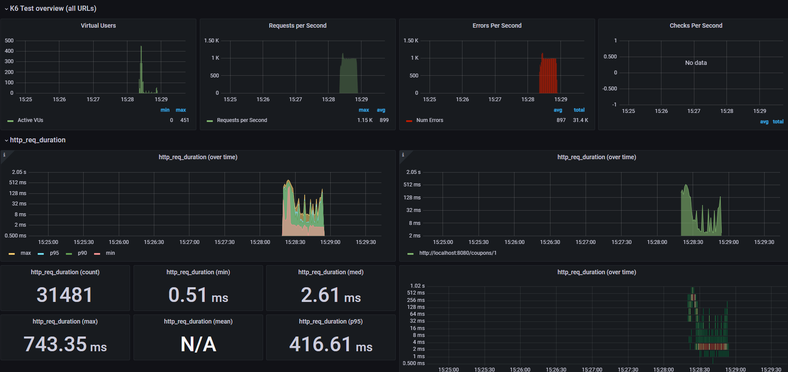
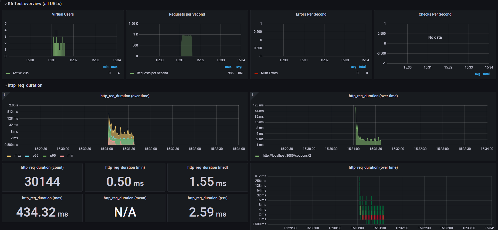
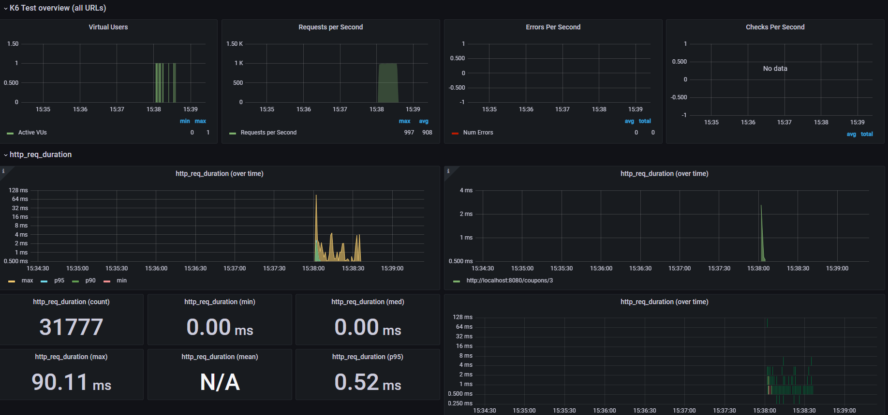
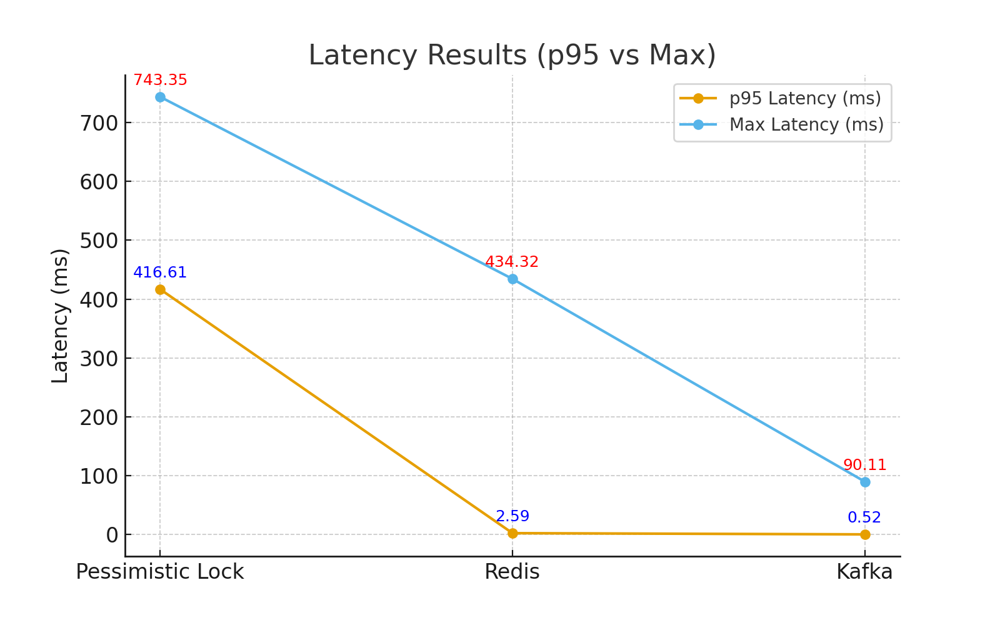

# 부하 테스트

## 목차
1. [목적](#1-목적)
2. [테스트 대상 선정 및 내용](#2-테스트-대상-선정-및-내용)
3. [테스트 도구 선정(k6)](#3-테스트-도구-선정k6)
4. [시나리오](#4-시나리오)
5. [테스트 결과](#5-테스트-결과)
6. [결론](#6-결론)
7. [고려사항](#7-고려사항)
8. [k6 부하 테스트 설정 및 코드 작성](#8-k6-부하-테스트-설정-및-코드-작성)

<br/>

## 1. 목적
- 안정적인 서비스 운영을 위해 배포 전 부하 테스트를 통해 각 기능의 예상 TPS, 응답시간, 동시성 이슈 등을 미리 파악하고 장애를 유발할 수 있는 테스트 시나리오를 통해 사전에 식별할 수 있도록 한다.

<br/>

## 2. 테스트 대상 선정 및 내용
- 기능: 선착순 쿠폰 발급 기능
- 사유: 동시에 최소 수 천명에서 수만명에 이르는 요청이 한 번에 몰릴 것으로 예상되는 API이며, 대용량 트래픽으로 인해 서버에 많은 영향을 끼칠 것으로 사료됨
- 내용: 10주차까지 선착순 쿠폰에 대한 성능 개선 단계별로 부하 테스트를 적용하여 비교
  - 비관 락 vs 레디스 vs 카프카

<br/>

## 3. 테스트 도구 선정(k6)
부하 테스트 도구 중 **k6**가 러닝 커브가 쉽고, 언어가 JavaScript를 지원하므로, k6로 선정하여 진행한다.

| 항목             | **k6** ✅               | **JMeter**             | **Locust**       |
| -------------- |------------------------| ---------------------- | ---------------- |
| **스크립팅 언어**    | **JavaScript**         | XML (Groovy 가능)        | Python           |
| **러닝커브**       | **쉬움 (개발자 친화적)**       | 어려움 (XML 기반)           | 쉬움 (Python)      |
| **성능(리소스 효율)** | 높음 (Go 기반)             | 낮음 (Java 기반, 무거움)      | 보통 (Python 기반)   |
| **프로토콜 지원**    | 제한적 (HTTP, WS, gRPC 등) | 광범위 (HTTP, JMS, FTP 등) | 주로 HTTP          |
| **분산 부하**      | Cloud 필요               | 자체 지원 (Master-Slave)   | 자체 지원 (분산 실행 용이) |
| **GUI 지원**     | 없음 (CLI 중심)            | 풍부함                    | 없음 (CLI 중심)      |
| **CI/CD 통합**   | 강점                     | 가능하나 복잡                | 강점               |

<br/>

k6로 부하 테스트한 결과를 **InfluxDB**에 저장하고 **Grafana**로 시각화해서 볼 수 있다.

| 도구 및 라이브러리     | 설명                           | 포트              |
|----------------|------------------------------|-----------------|
| **InfluxDB**   | 시계열(time-series) 데이터베이스 <br/> 주로 IoT 센서 데이터, 애플리케이션 로그, 서버/네트워크 성능 지표 같은 시계열 기반 데이터를 저장하고 조회하는 데 최적화되어 있음 | 8086            |
| **Chronograf** | InfluxDB용 시각화 및 관리 UI 도구                   | 8888            |
| **Grafana**    | 오픈소스 데이터 시각화 및 모니터링 툴        | 3000            |


<br/>

## 4. 시나리오
- 목표 기능: “쿠폰 발급 API” (단일 기능)
- 조건: 동시 1000명 → 동시성(Concurrency) 테스트 
- 제한: 쿠폰 수량 100개 (경쟁 상황 재현)
- 환경: 로컬에서 테스트 → 네트워크 지연/분산 환경은 반영 안 됨
- **Peak Test(최고 부하 테스트)**
  - 시스템에 일시적으로 많은 부하가 가해졌을 때, 잘 처리하는지 평가
  - 목표치로 설정한 임계 부하를 일순간에 제공했을 때, 정상적으로 처리해내는지 파악
  - 선착순 이벤트 등을 준비하면서 정상적으로 서비스를 제공할 수 있을지 파악해 볼 수 있음

<br/>

## 5. 테스트 결과
- 선착순 쿠폰의 성능 개선 단계별 피크 테스트 진행
  - 비관락
  - 레디스(Redis)
  - 카프카(Kafka)
- 쿠폰 수량과 정책은 똑같지만 다른 각기 다른 `쿠폰정책ID`로 시나리오 진행

### 비관 락


- Errors Per Second: 비관락 점유로 인한 DB 에러 발생

| 항목                                  | 내용                                      | 
|-------------------------------------|-----------------------------------------|
| **RPS**                             | **avg** 899 <br/> **max** 1,150         | 
| **Latency<br/>(http_req_duration)** | **p95** 416.61ms <br/> **max** 743.35ms |

### 레디스


| 항목                                  | 내용                                    | 
|-------------------------------------|---------------------------------------|
| **RPS**                             | **avg** 861 <br/> **max** 986         | 
| **Latency<br/>(http_req_duration)** | **p95** 2.59ms <br/> **max** 434.32ms |

### 카프카


| 항목                                  | 내용                                   | 
|-------------------------------------|--------------------------------------|
| **RPS**                             | **avg** 908 <br/> **max** 997        | 
| **Latency<br/>(http_req_duration)** | **p95** 0.52ms <br/> **max** 90.11ms |

<br/>

## 6. 결론
- Kafka를 활용한 “쿠폰 발급 API”은 1,000명 사용자 동시 요청에 적절한 성능으로 운영 가능함
- k6 도구를 이용해 선착순 쿠폰 기능에 대한 성능 개선 단계별 부하 테스트를 진행했고, Kafka를 활용해 응답시간에 대한 성능을 높였다.
- **Latency 개선(p95)**: 416.61ms ➡️ 2.59ms ➡️ 0.52ms




<br/>

## 7. 고려사항
- 실제 운영에서는 1,000명이 아닌 2만명으로 테스트
  - 올리브영 쿠폰 발급 사례의 1만명 요청 비즈니스를 참고해 2배인 2만명 산정
  - [올리브영 선착순 쿠폰 1만명 대기열(쿠폰 발급 후기 블로그)](https://www.powderroom.co.kr/board/88214249)

<br/>

## 8. k6 부하 테스트 설정 및 코드 작성
### k6 설치
- [k6 깃허브 릴리즈](https://github.com/grafana/k6/releases)에서 다운 받아 설치한다.

### 도커 컴포즈 설정
```yaml
  influxdb:
    image: influxdb:1.8.3
    ports:
      - "8086:8086"
    volumes:
      - ./data/influxdb:/var/lib/influxdb
    environment:
      - INFLUXDB_DB=k6
      - INFLUXDB_ADMIN_ENABLED=true
      - INFLUXDB_ADMIN_USER=root
      - INFLUXDB_ADMIN_PASSWORD=root

  chronograf:
    image: chronograf:1.8.7
    ports:
      - "8888:8888"
    depends_on:
      - influxdb
    environment:
      - HOST=0.0.0.0
      - PORT=8888
      - INFLUXDB_URL=http://influxdb:8086

  grafana:
    image: grafana/grafana:9.3.6
    ports:
      - "3000:3000"
    volumes:
      - ./data/grafana:/var/lib/grafana
    depends_on:
      - influxdb
    environment:
      - GF_SECURITY_ADMIN_USER=root
      - GF_SECURITY_ADMIN_PASSWORD=root
      - GF_USERS_ALLOW_SIGN_UP=false
      - GF_SERVER_ROOT_URL=%(protocol)s://%(domain)s/
```

### 도커 및 서버 실행
- 도커 컴포즈 실행
```shell
docker-compose up -d
```
- `ServerApplication` 실행

### 부하테스트 스크립트 작성(`script.js`)
```yaml
import http from 'k6/http';
import { check } from 'k6';
import { Counter, Trend } from 'k6/metrics';

// ---- 설정값
const BASE_URL = __ENV.BASE_URL || 'http://localhost:8080';

// ---- 메트릭
const mResp = new Trend('coupon_response_time');

// ---- 피크 시나리오 (로컬 환경용)
export const options = {
  discardResponseBodies: true,
  scenarios: {
    peak: {
      executor: 'ramping-arrival-rate',
      startRate: 0,
      timeUnit: '1s',
      preAllocatedVUs: 400,
      maxVUs: 1500,
      stages: [
        { target: 1000 ,duration: '2s' },   // 피크 도달
        { target: 1000, duration: '30s' },  // 피크 유지
        { target: 0 , duration: '2s' },     // 램프 다운
      ],
      gracefulStop: '5s',
      tags: { test_type: 'peak' },
    },
  },
  thresholds: {
    http_req_failed: ['rate<0.2'],
    'http_req_duration{scenario:peak}': ['p(95)<1000'],
  },
};

// ---- VU 함수
export default function () {
  const policyId = 3;

  // 유저 ID 샘플링
  const userId = Math.floor(Math.random() * 1000) + 1;

  // 요청
  const res = http.post(
    `${BASE_URL}/coupons/${policyId}`,
    JSON.stringify(userId),
    { headers: { 'Content-Type': 'application/json' } }
  );

  // 응답 시간 기록
  mResp.add(res.timings.duration);
}
```

### k6 부하테스트 실행
- `script.js` 실행
- `--out`옵션: InfluxDB에 부하 테스트 결과를 저장
```shell
k6 run --out influxdb=http://localhost:8086/k6 script.js
```

### Grafana 대시보드 설정
- Grafana 접속: http://localhost:3000

#### 데이터베이스 설정
- 데이터베이스 추가
  - Configuration → Data sources → `Add data source`
- 데이터베이스 정보 입력
  - Name: InfluxDB
  - Query Language: InfluxQL
  - URL: http://<InfluxDB 도커 컨테이너명>:8086 (http://influxdb:8086)
  - Database: k6
  - User: root
  - Password: root
- `Save & test` 클릭 후 연결 성공(초록색) 확인

#### 대시보드 템플릿 적용
- Dashboards → `+ Import`
- Import via grafana.com: `19630` 입력 (템플릿 ID 복사: [19630-k6-dashboard](https://grafana.com/grafana/dashboards/19630-k6-dashboard/))
- `Load` 클릭해 템플릿 적용