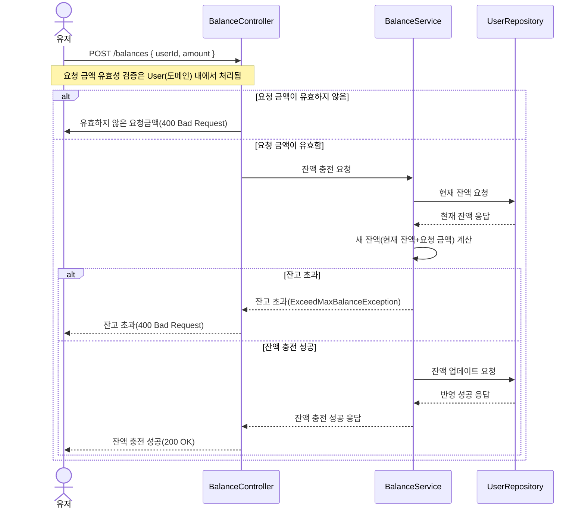
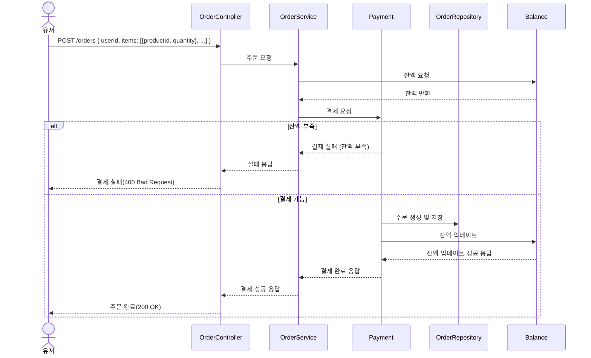

# 시퀀스 다이어그램

---
## 작성 흐름
- `유저(Acotr)` 작성
  - 프론트엔드와 협업에 쓰인다고 가정
  - 시퀀스 다이어그램 작성 학습을 위해
- `Contorller`-`Service`-`Repository`로의 흐름으로 작성
  - 여러 기능이 표현되는 경우 핵심 기능만 `Contorller`-`Service`-`Repository` 작성
---  
## 잔액 충전

---
## 주문/결제
