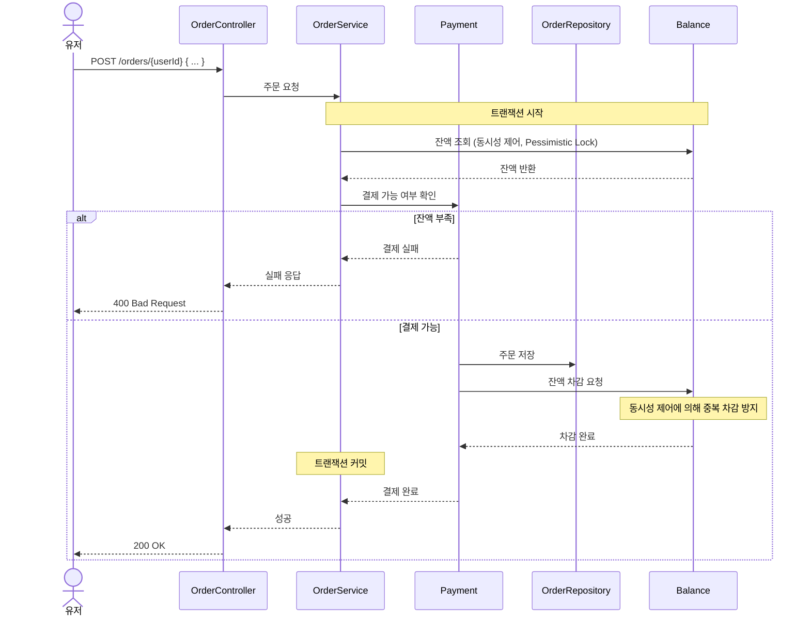

# 시퀀스 다이어그램

---
## 작성 흐름
- `유저(Acotr)` 작성
  - 프론트엔드와 협업에 쓰인다고 가정
  - 시퀀스 다이어그램 작성 학습을 위해 상세 작성
- `Contorller`-`Service`-`Repository`로의 흐름으로 작성
  - 여러 기능이 표현되는 경우 핵심 기능만 `Contorller`-`Service`-`Repository` 작성
- 동시성 제어는 우선 비관적 락(Pessimistic Lock)으로 작성
  - 분산 락(Distributed Lock) 개념 더 공부 후에 설계를 수정하기로 함
---  
## 잔액 충전

---
## 주문/결제

## 쿠폰 발급
